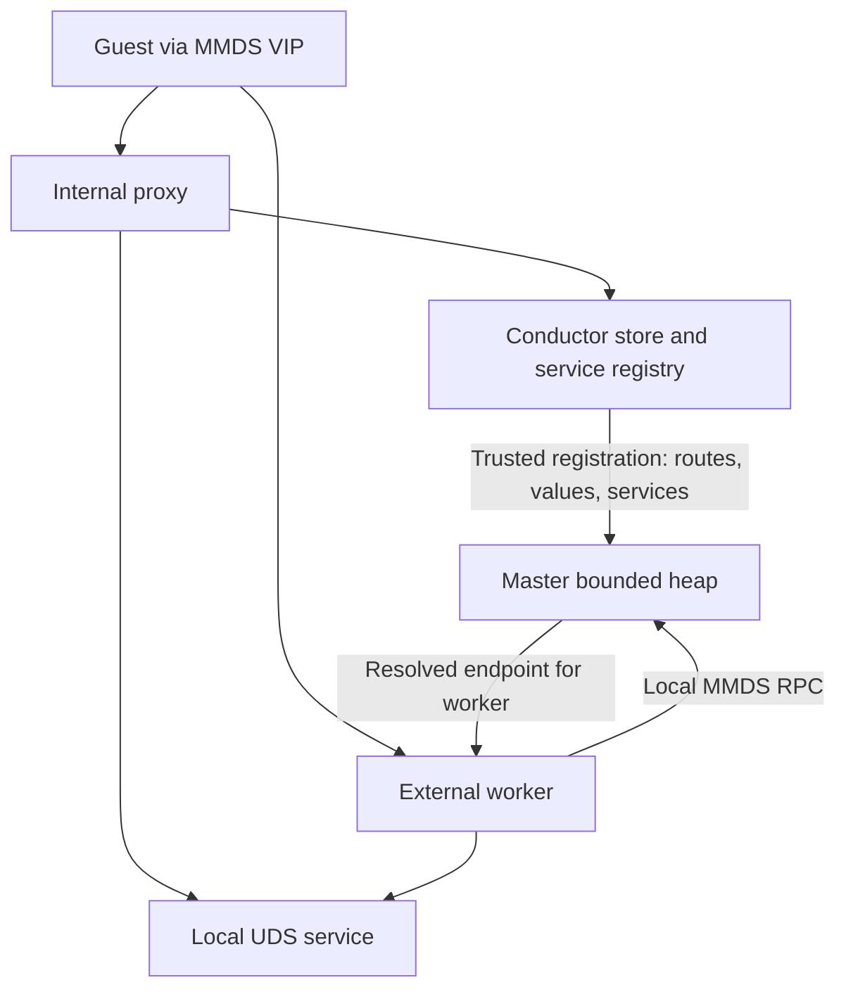
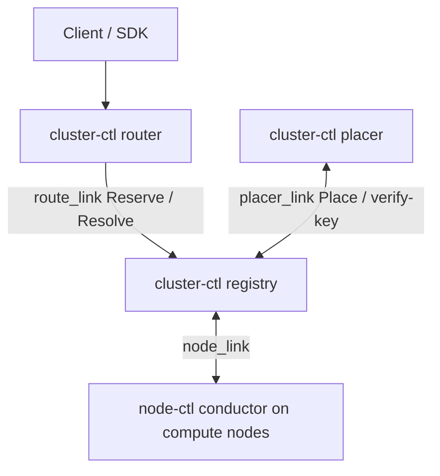
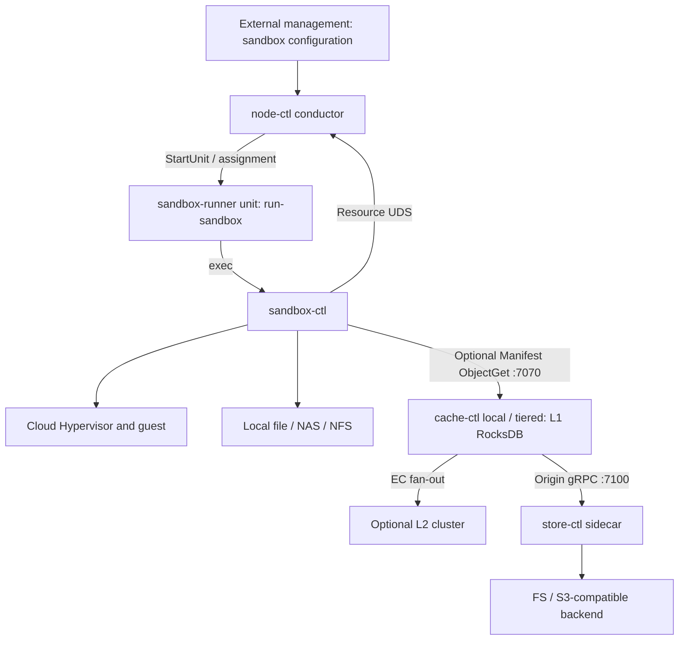
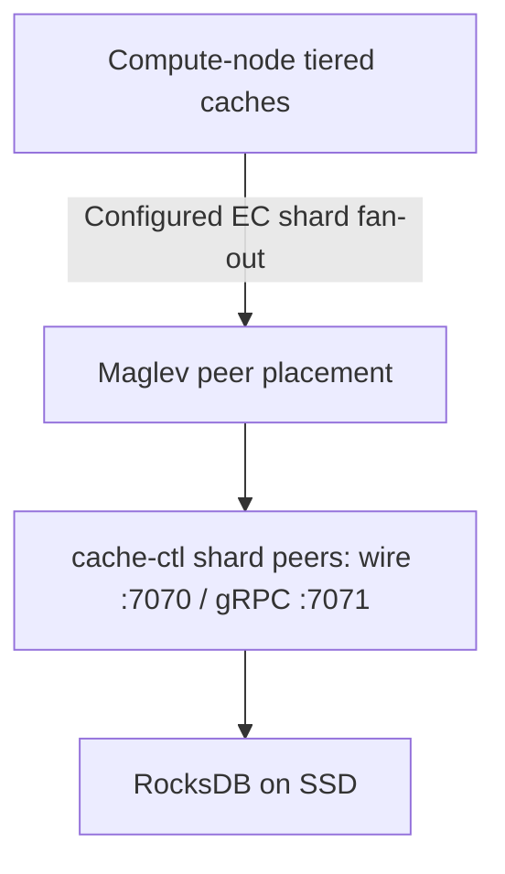
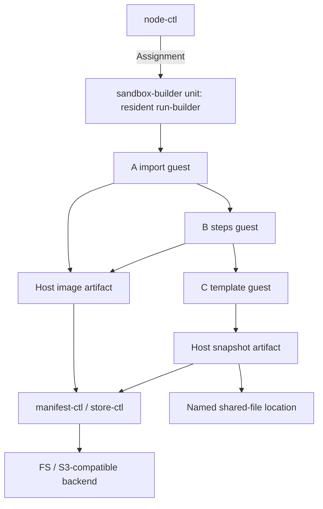

[English](deployment.md) | [简体中文](deployment_zh.md)

<a id="deployment--部署拓扑与组件清单"></a>

# deployment — deployment topology and component inventory

The platform consists of independently deployed processes communicating through gRPC, the cache wire protocol, vsock and Unix domain sockets (UDS). This operations/SRE guide defines process ownership, responsibilities, configuration entry points and startup/shutdown dependencies.

Each component's design document owns its CLI, configuration schema and internal behavior. This guide explains where processes run, how they find one another and their ordering dependencies.

<a id="1-角色概览"></a>

## 1. Role overview

Select roles according to the data path and control-plane topology. Local files, shared files and Manifest/store/cache are separate choices; Manifest and caching are not prerequisites for either standalone or cluster deployment.

**Node and cluster roles**

| Role | Responsibility | Main processes |
|---|---|---|
| Compute Node | Hosts MicroVMs and node resource control; E2B template builds also run in build sandboxes on this node (§5). | `node-ctl conductor serve`, optionally with `resource_listen`; external proxy adds a master and workers; `sandbox-ctl × N`. Deploy `cache-ctl` when selected for the Manifest path, and `store-ctl` for Manifest storage or image-producing builds. |
| Shared Storage | Native cross-node file access for named `file://` locations. | Operator-provided NAS, NFS or shared filesystem. |
| L2 Cache Cluster (optional) | Distributed EC caching for the Manifest path; without it, cache can hit locally or read the origin. | `cache-ctl shard`. |
| Cluster Control Plane (optional) | E2B-compatible multi-node control: registry maintains execution state, router supplies the common entry point, and placer imports groups and selects placement. Nodes still execute lifecycle operations. | `cluster-ctl registry`, `cluster-ctl router`, `cluster-ctl placer`. |

**External shared resources**, operated outside the platform:

| Resource | Purpose |
|---|---|
| Local/NAS/NFS | Local or shared native-file artifacts, without mandatory conversion to content chunks. |
| FS or S3-compatible store | Durable backend for Manifests and chunks. |
| Platform management plane | Instance scheduling, configuration, tenancy and template-build credentials (registry pull tokens/customer keys). Imports sandbox-group configuration through the cluster placer/provider, or calls the standalone `node-ctl` E2B API directly. |
| Container registry | Tenant image source, pulled as needed by `flatten-ctl` in the build sandbox; supports OCI 1.1 Referrers. |

## 2. Compute Node

<a id="21-常驻进程"></a>

### 2.1 Resident processes

| Process | Role | Count | Lifecycle | Owner |
|---|---|---|---|---|
| `node-ctl conductor serve` | Local orchestration, E2B-compatible control plane, optional node resource arbitration and node-link client. Drives sandbox-ctl through `sandbox-runner@<run-id>` and `sandbox-builder@<run-id>`. With `proxy.mode=internal`, also hosts the data-plane proxy. | One conductor per node. | systemd. | [orchestrator/node](https://github.com/kuasar-sandbox/orchestrator/blob/main/docs/node.md); resource protocol in [node-resource](https://github.com/kuasar-sandbox/orchestrator/blob/main/docs/node-resource.md). |
| `node-ctl proxy serve` (external mode) | Master subscribes to routes and conductor-owned MMDS policy over config-socket, binds data/MMDS listeners and manages workers. Workers read fixed routes through mmap and query mutable MMDS routes/values/services through local master RPC; they authenticate and proxy data traffic, including the native exec gate. | One master plus configured `workers`. | systemd. | [orchestrator/node-proxy](https://github.com/kuasar-sandbox/orchestrator/blob/main/docs/node-proxy.md). |
| `cache-ctl` (`mode: local|tiered`, optional) | Manifest read entry: local L1, optional EC L2 and store origin. | Commonly one per selected cache configuration; separate domains can use separate instances. | systemd; start before consumers of this Manifest path. | [accelerator/cache](https://github.com/kuasar-sandbox/accelerator/blob/main/docs/cache.md). |
| `store-ctl` (optional) | Node-side read/write service for FS/S3-compatible Manifest storage. | Commonly one sidecar per node/storage configuration. | systemd; required for the selected Manifest path or image-producing builds. | [accelerator/store](https://github.com/kuasar-sandbox/accelerator/blob/main/docs/store.md). |
| `sandbox-ctl run` | Controls one sandbox, similar in lifecycle to `runc run`; not a shared daemon. | One per sandbox. | Assigned by node-ctl through `sandbox-runner@<run-id>` and its `run-sandbox` launcher. | [sandboxer/sandbox](https://github.com/kuasar-sandbox/sandboxer/blob/main/docs/sandbox.md). |
| `cloud-hypervisor` | Patched VMM, child of sandbox-ctl. | One per sandbox. | Spawned by sandbox-ctl. | [sandboxer/cloud-hypervisor](https://github.com/kuasar-sandbox/sandboxer/blob/main/docs/cloud-hypervisor.md). |

<a id="22-端口与套接字"></a>

### 2.2 Ports and sockets

Bind node-local storage, cache and control services to loopback or UDS. Public API/data listeners and L2 peer listeners are deliberate exceptions. The addresses below are deployment examples/conventions; the selected configuration determines actual listeners.

| Process | Listener | Protocol | Purpose |
|---|---|---|---|
| `store-ctl` | `127.0.0.1:7100` | gRPC | `Put` / `Get` / `GetSalt` for local cache-ctl and manifest-ctl. |
| `store-ctl` | `127.0.0.1:7061` | gRPC health | Probes. |
| `cache-ctl tiered` | `127.0.0.1:7070` | Custom binary TCP wire | sandbox-ctl/manifest-ctl chunk reads. |
| `cache-ctl tiered` | `127.0.0.1:7071` | gRPC | Health, `ping`, `info`. |
| `node-ctl conductor serve` (`resource_listen`) | `/run/sandbox-resource.sock` | Resource protocol over UDS | sandbox-ctl resource-controller dial target. |
| `sandbox-ctl` | `<run_root>/sandboxes/<sid>/*.sock` for node-managed sandboxes | UDS | `ch.sock`, `blk{0,1}.sock`, `uffd.sock`, `ctl.sock`, `vsock.sock` and `_5000`; `<sid>.pid` authenticates the task on config-socket. Assignment/launch parameters come through config-socket, not an `SANDBOX_ARGS` envfile. |
| `node-ctl conductor serve` | `api.listen`, e.g. `:443` | HTTPS/h2 | Public E2B control API. In internal proxy mode its handler also serves sandbox data; `proxy.data_listen` can select a separate data entry. |
| `node-ctl proxy serve` (external) | `proxy.yaml.data_listen` | HTTPS/h2 or h2c | Separate data entry. Master binds the listener and passes FDs to workers. Native exec uses CONNECT with `service=exec` and `X-Access-Token`. |
| Conductor/external proxy | Conductor `mmds.listen`, default `127.0.0.1:19254` | HTTP/1.1 | Target of vswitch `--mgmt-service`. Internal mode binds in conductor; external master receives trusted Hello policy, binds and passes the FD to workers. |
| MMDS local service | `mmds.services.<name>.endpoint` | HTTP/1.1 over UDS | Conductor-only registry; V1 requires an absolute `unix://` path. Internal proxy dials directly; external worker obtains the resolved socket path from master. |
| `node-ctl conductor serve` | `/run/sandbox/node-ctl.socket` | HTTP/h2c and framed JSON streams over UDS | Five config-socket planes: run/task/admin/plugin/api. Launchers obtain task/launch/build specifications; admin manages Manifest keys and sandbox MMDS values; external proxy/platform extensions register and synchronize permitted routes over the plugin plane. Authentication uses SO_PEERCRED and task/runner/admin/plugin pidfiles. |

Tiered cache dials L2 peer port `7070` through the node network (§3). Local cache or direct store access does not require L2. In internal mode conductor shares its API handler with the proxy. In external mode `node-ctl proxy serve` starts one master and the configured workers; data traffic enters `proxy.yaml.data_listen`, while control traffic remains at conductor `api.listen`.

External workers require node-local `proxy.yaml.paths.run_root`. They derive `<run_root>/sandboxes/<NodeSandboxID>/ctl.sock`; routesync Policy and the shared-memory route view do not carry this root. Proxy YAML does not duplicate `mmds_listen` or `services`: conductor's trusted `proxy + route_wake + mmds` registration is their sole projection channel. Other node-local services use loopback/UDS.

Conductor starts sandbox-ctl through the **`sandbox-runner@<run-id>.service` template**, using StartUnit/prestarted units. `run-sandbox` waits for assignment, obtains the exact task and final LaunchSpec, then exec-replaces itself with `sandbox-ctl run`; conductor does not directly fork-exec that runtime. Builds use **`sandbox-builder@<run-id>.service`**: `run-builder` waits for assignment and remains resident while driving the target-selected import/steps/template pipeline, with at most one phase MicroVM at a time as its child. Image parsing/pulling and step execution occur in guests (§5). Conductor generates/installs both templates at startup unless `install_units: false` delegates their management to the operator. See node.md §5/§12.

The sandbox's `ctl.sock` serves snapshot and local `sandbox-ctl exec --sandbox-id <sid> -- CMD` operations. For a node-managed sandbox, the local client must use the effective sandbox root, e.g. `--run-root /run/sandbox/sandboxes`, to find that socket. Remote access does not expose the UDS: first use `X-API-KEY` to request a `kat1` ExecAccessToken bound to AuthSandboxID. `sandbox-ctl exec --proxy`, with repeatable `--proxy-header`, sends SID, `service=exec`, token and cluster context through CONNECT. Node proxy verifies the token and dials the existing UDS; `pkg/ctl.ProxyExec` restricts the first frame to `exec_request`. The client delivered by [sandboxer #28](https://github.com/kuasar-sandbox/sandboxer/issues/28) is used by standalone, cluster and external-proxy real-guest E2E, replacing temporary CONNECT bridges. The full contract belongs to sandbox.md and node-proxy.md.

<a id="23-持久化与运行时目录"></a>

### 2.3 Persistent and runtime directories

With node roots `/run/sandbox` and `/var/lib/sandbox`, the current node-managed layout is:

| Path | Contents |
|---|---|
| `/var/store/` | store-ctl FS backend on local/shared storage. |
| `/var/cache/accel-l1/` | local/tiered L1 RocksDB, sized for the working set. |
| `/run/sandbox/runners/<run-id>.pid` | Runner/build execution pidfile. |
| `/run/sandbox/sandboxes/<sid>/` | Sandbox sockets, task pidfile/configuration and temporary CH metadata staging (`snap-stage`/`snap-state`); tmpfs. |
| `/var/lib/sandbox/sandboxes/<sid>/` | Persistent sandbox state, including `<sid>.overlay.diff` and `checkpoint/`. |
| `/run/sandbox/builds/<BuildID>/` | Build pidfile and phase runtime directories/sockets; the complete validated BuildID is the directory name. |
| `/var/lib/sandbox/builds/<BuildID>/checkpoint/` | Build image and snapshot artifacts. |
| `/var/lib/sandbox/node-ctl.db` | Default conductor SQLite database (`db_path`). |

`paths.run_root` is for small volatile state and sockets; `paths.base_root` holds larger disk-backed state. The resource controller rebuilds live accounting from inventory/reports; deprecated `resource_listen.state_path` is ignored and is not a resource `state.json` persistence mechanism. Audit output, when configured, is separate.

Direct sandbox-ctl uses its supplied `--run-root`/`SANDBOX_RUN_ROOT` and `--base-root`/`SANDBOX_BASE_ROOT`, with PathID as the directory leaf. Conductor passes the derived `sandboxes/` roots for ordinary sandboxes. Thus standalone `/run/sandbox/<sid>` examples cannot be copied unchanged into a node-managed deployment. Writable overlays belong on disk, while snapshot outputs are selected by `--output` or the orchestrator's checkpoint path. See [nodepath](https://github.com/kuasar-sandbox/orchestrator/blob/main/internal/nodepath/path.go).

<a id="24-节点共享资源目录"></a>

### 2.4 Shared node resources

Maintain named shared inputs instead of provisioning a private copy for each sandbox:

| Example path | Use |
|---|---|
| `/opt/sandbox/kernel/<ver>/vmlinux` | Coexisting kernel versions selected through sandbox configuration. |
| `/opt/sandbox/runtime/<ver>/sandbox-runtime.bundle` | Coexisting runtime versions. |
| `/opt/sandbox/overlay-templates/overlay-1g.ext4` | Preformatted 1 GiB ext4 template. |
| `/opt/sandbox/overlay-templates/overlay-4g.ext4` | Preformatted 4 GiB ext4 template. |
| `/opt/sandbox/overlay-templates/overlay-16g.ext4` | Preformatted 16 GiB ext4 template. |

Example `SANDBOX_CONFIG`:

```yaml
boot:
  kernel:  file:///opt/sandbox/kernel/6.1.169-sandbox/vmlinux
  runtime: file:///opt/sandbox/runtime/v1/sandbox-runtime.bundle
  root:
    overlay:
      # Omitted diff uses the effective base root and PathID; see §2.3.
      diff_template: file:///opt/sandbox/overlay-templates/overlay-1g.ext4
```

**Provisioning:** the configured runtime/kernel files are shared inputs, not per-sandbox copies. Runtime virtio-pmem/DAX can share immutable backing pages through host page cache. Loading one shared kernel file does not mean all guests share one resident kernel working set; each guest has its own execution state.

The overlay is a private writable disk. If `diff` is omitted, sandbox-ctl owns a new diff under its effective disk-backed base directory. A `diff_template` seeds it from the template's logical sparse contents, applying configured active-diff encryption when enabled; node-ctl need not `cp` the template. An existing nonempty explicit diff is opened according to its format/policy and remains caller-owned. An absent explicit path can also be provisioned from the configured template/base; an existing empty diff is rejected. See [PrepareDiff](https://github.com/kuasar-sandbox/sandboxer/blob/main/pkg/sandbox/overlaydiff.go) and [active-diff storage](https://github.com/kuasar-sandbox/sandboxer/blob/main/pkg/vhost/diff_file.go).

<a id="25-per-sandbox-配置下发"></a>

### 2.5 Per-sandbox configuration delivery

Conductor renders per-sandbox YAML at `<run_root>/sandboxes/<sid>/<sid>.yaml`, mode `0600`. Treat it according to its contents, including user-provided launch environment; do not assume all configuration is nonconfidential. The runner receives assignment/task/final LaunchSpec over config-socket and passes the YAML path to sandbox-ctl.

For a Manifest data path, use shared **`MANIFEST_CONFIG`** with `manifest.key` empty and a per-sandbox **`MANIFEST_KEY`** environment value. Local files and named shared-file references do not require a Manifest configuration first.

| Input | Contents | Delivery | Contract |
|---|---|---|---|
| `SANDBOX_CONFIG` | Resources, boot, networking and launch settings. | `sandbox-ctl run --config <path>`; standalone CLI also supports `SANDBOX_CONFIG`. | sandbox.md §3. |
| `MANIFEST_CONFIG` (as needed) | Local store/cache endpoints and content-protection parameters. | `--manifest-config <path>` or fallback `MANIFEST_CONFIG`; manifest-ctl uses the same format. | manifest.md §3. |

- **Per-sandbox key:** each sandbox uses its tenant's customer content key. In E2B, node-ctl decrypts the stored APISecret/ManifestKey credential pair; ManifestKey supplies `MANIFEST_KEY`, while **APISecret signs `api_key`**. See node.md §7. An external plane directly integrating with standalone node-ctl must respect the same per-sandbox key lifecycle.
- **Shared format:** manifest-ctl and sandbox-ctl use the same Manifest schema and connect to the selected store/cache topology; named file paths do not traverse that data plane.
- **Explicit path selection:** the Manifest loader checks the flag first, then `MANIFEST_CONFIG`. It does not discover a current-directory/global default. With neither, it returns `ErrConfigNotProvided`; callers decide whether this is fatal or disables unused Manifest features. See [LoadConfig](https://github.com/kuasar-sandbox/accelerator/blob/main/pkg/manifest/load.go).

<a id="26-mmds-route-安全与部署边界"></a>

### 2.6 MMDS route security and deployment boundaries

Custom routes require conductor `mmds.routes.enabled=true`. Sandbox Create and Build Register declare exact static/secret/service routes through `X-Kuasar-Sandbox-MMDS` or metadata, merging Header and metadata independently at the top-level `secrets` and `routes` keys. After admission ordinary metadata retains canonical routes; initial values are encrypted in SQLite under the sandbox/build owner. Local admin UDS can PUT/DELETE declared names. There is no cluster Secret API.



A service route constructs `GET <exact-path>` over UDS with Host `mmds-service`, adding only `E2b-Sandbox-Id` and `E2b-Sandbox-Service`. It does not forward guest headers/query/body or follow redirects. Internal mode uses conductor's registry directly. External master atomically receives that registry in trusted registration Hello policy; workers do not read a second YAML. A routesync disconnect immediately closes external MMDS access; only a complete Bookmark reopens it.

Routes can move in a standalone migration token's portable metadata; secret values do not migrate. Only when the target is absent and an import actually occurs may standalone CONNECT add secrets-only MMDS input. An existing target skips parsing both migration token and secret input. Cluster CONNECT, node-link and placement do not extend this MMDS contract, and there is no cluster MMDS E2E.

Build Register routes/values serve only that build's sandbox. Trigger cannot override them. A terminal build transaction deletes the route namespace from Build metadata and removes the value blob. Publication does not copy this configuration into the final image/template/snapshot. However, a guest GET can put plaintext in ordinary guest/application memory or files, which a later memory snapshot or image export can capture. Protect such artifacts as sensitive data; host-side deletion cannot remove plaintext already consumed by the guest.

## 3. L2 Cache Cluster

L2 is optional acceleration for the Manifest path. Use local cache plus origin alone, or deploy shards according to working set and failure domains. It does not participate in native local/named shared-file reads.

<a id="31-集群规格"></a>

### 3.1 Cluster specification

- **Size:** choose from measured working set, desired hit rate, SSD capacity, networking and failure domains.
- **Encoding:** `data_shards: 4, parity_shards: 1` encodes each chunk as five shards when enough peers are available.
- **Placement:** Maglev deterministically selects the ordered peer set from chunk hash, using `LocateN(key, 5)`/the EC router's peer-selection path. A true RS 4+1 deployment needs at least five peers. Initial construction clamps an oversized scheme to available peers, so a smaller pool must not be described as still providing 4+1. Inspect the effective scheme and startup log. Adding peers does not replace the placement algorithm; see cache.md §4.9.
- **Resources:** size SSD, RocksDB BlockCache (`mem_ratio`) and networking from deployment measurements.
- **Isolation:** image-chunk and snapshot-chunk domains can use separate cluster instances with different RocksDB paths and membership.
- **Persistence:** RocksDB under e.g. `/mnt/ssd/accel-l2` can retain cached data across a daemon restart. Cache remains reconstructible; this does not promise survival of every crash, storage failure or unsynced write.

<a id="32-端口"></a>

### 3.2 Ports

| Process | Listener | Protocol | Purpose |
|---|---|---|---|
| `cache-ctl shard` | `0.0.0.0:7070` | wire | Shard PUT/GET from compute-node tiered cache. |
| `cache-ctl shard` | `0.0.0.0:7071` | gRPC | Health and `info`. |

Shard mode neither reads L3 nor holds origin credentials. It is a KV service; peers do not require a shard leader.

<a id="33-成员变更"></a>

### 3.3 Membership changes

Each compute node's tiered YAML lists `tiers[].cluster.peers`. Adding/removing a peer is a compute-side **configuration change plus SIGHUP**, rebuilding the Maglev table. The affected keys depend on the old/new membership; do not assume a universal exact `1/M` movement ratio. Surviving peers can return existing framed shards by their recorded shard index.

**Change one peer at a time.** Changing two or more peers can lose more than the single parity allowance of a 4+1 key, producing an L2 miss and falling through to origin. Confirm convergence/hit behavior before the next change; one-at-a-time operations are a precaution, not an unconditional no-miss guarantee. Shard nodes themselves remain KV servers and do not need the membership list.

<a id="4-外部持久化与管理资源"></a>

## 4. External persistence and management resources

<a id="41-存储后端"></a>

### 4.1 Storage backends

Local/named shared-file artifacts are carried directly by the filesystem. For Manifest data, store-ctl supports FS and S3-compatible backends: FS root can be local or shared, and S3-compatible storage can use one or multiple buckets. Operators choose capacity, failure domains and sharing scope. Store-ctl owns its internal paths; see store.md.

S3-compatible access uses deployment configuration or the SDK default credential chain. Origin credentials stay in trusted host services, outside guests and documentation examples. Each node may run a store-ctl sidecar against the same durable backend; FS can also use a node-local directory.

<a id="42-外部管理面接口"></a>

### 4.2 External management interface

The region-level management plane is independently operated outside this project:

- In multi-node deployments, it imports sandbox-group configuration, selectors, customer-key references and template-build credentials through placer/provider.
- In standalone deployments, it can call the node-ctl E2B API and supply the configuration contract in §2.5, adding content-protection configuration when using Manifest data.
- An externally supplied node bridge/agent is not part of these release assets and does not redefine this guide's processes, configuration or dependencies.

Builds run in compute-node build sandboxes (§5); there is no separate flatten management/data pool.

<a id="5-镜像构建构建沙箱内三阶段"></a>

## 5. Image builds: three phases inside build sandboxes

E2B template builds run on compute nodes without a separate flatten pool. Each execution owns `sandbox-builder@<run-id>`, whose resident `run-builder` drives guest MicroVMs. Image parsing/pulling and steps occur inside those guests. The host still carries exec streams, artifacts and final publication bytes; guest execution does not mean tenant bytes never pass through host userspace. See node.md §12.

<a id="51-三阶段流水"></a>

### 5.1 Three-phase pipeline

BuildSpec selects up to three phases, each using `sandbox-ctl run` plus Cloud Hypervisor and accounted within the build unit:

| Phase | Condition | Work |
|---|---|---|
| A import | `fromImage` supplied. | An empty single-disk sandbox uses flatten-ctl/mkfs.erofs from sandbox-runtime.bundle, pulls with tenant credentials and deterministically flattens in the guest. `flatten-ctl export --output - <image>` streams a tarstream artifact back through exec stdio. |
| B steps | `steps` supplied. | Base image, runtime and a large writable layer; envd is the application. RUN/ENV/ARG/WORKDIR/USER use envd `process.Start`, matching E2B semantics, then export the resulting image artifact. |
| C template | `startCmd` supplied. | Cold-boot the final image with the production E2B runtime; start through envd, poll readyCmd, then create a local snapshot bundle with sandbox-ctl snapshot. |

The channels have distinct purposes: E2B steps/startCmd/readyCmd use **envd**; platform operations such as flattening, configuration injection, artifact streaming and readiness probes use **sandbox-ctl exec**. COPY context uses object storage (`builder.files_storage`, presigned PUT/GET), avoiding upload-body relay through the public control API. During the build, host/guest transfer and `flatten-ctl tar extract` deliver/extract that context; do not interpret this as a guarantee that no host process handles its bytes.

<a id="52-收尾上传平台凭据唯一出现点"></a>

### 5.2 Final publication: platform storage credentials

Phase artifacts pass sequentially through the host's build directories. Final image publication ingests `image.img` with manifest-ctl and produces a canonical Manifest reference; snapshot publication uses `sandbox-ctl upload-snapshot <bundle>`. Image-producing builds always require store-ctl. `checkpoint.remote.ref_location_parent` selects the snapshot destination only: without a named location, publish to Manifest; with one, publish to the shared-file location.

The durable ID is `<profile>-<kind>-<base64url(canonical-portable-ref)>`. In Manifest mode, local store-ctl (§2.1) performs remote writes. Origin storage credentials belong to the host publication/storage path, not guest build commands.

<a id="53-凭据与隔离"></a>

### 5.3 Credentials and isolation

Tenant registry credentials enter the import guest through `FLATTEN_*` exec environment. The builder's `MANIFEST_KEY` remains host-side. Node-ctl resolves task pull tokens, SDK-supplied plaintext or tenant default `registry_auth_enc`; see node.md §12. `sandbox-builder.slice` CPUQuota/MemoryMax limit aggregate build resources; `builder.max_concurrent` controls admission.

MMDS initial values from Build Register are a separate confidential flow: encrypted under the Build owner and projected only to the synthetic builder Sandbox route. They are not inserted into BuildSpec env or ordinary metadata, and publication does not copy the MMDS configuration into final artifacts. Trigger cannot overwrite them; ready/error/cleanup removes the encrypted blob. A guest can nevertheless copy fetched plaintext into files or memory captured by export/snapshot (§2.6).

## 6. Cluster Control Plane (cluster-ctl)

For multiple compute nodes, three roles compose the cluster layer: **registry**, a shardkv state cluster and node-channel hub; **router**, the common E2B control/data entry; and **placer**, the group provider/importer, WATCH_LIST consumer and placement scheduler. Router uses sandbox-group, route-key and stable sandbox_id, translating to NodeSandboxID at the node boundary. Exec Session uses `Reserve(operation=exec-session)` and `CmdExecSession` for node-side signing; Router and node validate the same KAT. Data Reserve for a non-READY route makes Registry validate again before triggering lifecycle work. See [cluster.md](https://github.com/kuasar-sandbox/orchestrator/blob/main/docs/cluster.md). A standalone node directly serving the E2B SDK does not require this layer.



<a id="61-进程"></a>

### 6.1 Processes

| Process | Role | Count | Lifecycle | Owner |
|---|---|---|---|---|
| `cluster-ctl registry` | Replicated `route_link`, `node_link`, `node_list`, `placer_link` execution state; node connections and route/node owner RPC. | One or more members; LocateN selects each group/node owner set. | systemd. | cluster.md. |
| `cluster-ctl router` | E2B control/data entry (`api.<domain>`), recent route cache. Data misses Resolve; known non-READY data routes Reserve. Create/connect/exec-session use their respective Reserve operations. Exec CONNECT replaces stable SID with current NodeSandboxID, preserving service/port/token. | Multiple stateless replicas behind LB. | systemd. | [cluster-router.md](https://github.com/kuasar-sandbox/orchestrator/blob/main/docs/cluster-router.md). |
| `cluster-ctl placer` | Group provider/importer, WATCH_LIST consumer and scheduler; PlaceSandbox/PlaceBuild/verify-key for registry. | Multiple replicas; deterministic group failover uses ready placer memberlist view. | systemd. | [cluster-placer.md](https://github.com/kuasar-sandbox/orchestrator/blob/main/docs/cluster-placer.md). |

Small deployments can colocate all three. Larger ones scale registry membership, router entry replicas and placer replicas separately.

<a id="62-端口"></a>

### 6.2 Ports

| Process | Listener | Protocol | Purpose |
|---|---|---|---|
| Router | `:443` | HTTPS/h2 | Public E2B control/data entry for the cluster. |
| Registry | `member.listen`, e.g. `:7700` | JSONRPC over HTTP/h2c or HTTPS | Unified control plane with `/node-link/*`, `/route-link/*`, `/placer-link/*`, `/cluster/membership`, `/internal/registry-member/*`, `/internal/memberlist/*`. |
| Registry | Optional `node_link.listen` | JSONRPC over HTTP/h2c or HTTPS | Separate node-connection listener; empty reuses member.listen. |
| Placer | `placer.listen`, e.g. `:7800` | JSONRPC over HTTP/h2c or HTTPS | Place/verify-key API; memberlist HTTP transport shares the listener. |

<a id="63-与节点--平台管理面的关系"></a>

### 6.3 Relationship to nodes and external management

- **Node connection:** conductor dials the configured registry node-link endpoint. The contacted member can redirect to the node owner or relay to an available owner. Node-link owners replicate the full node view. Route-link owners forward create/connect/delete/build/key commands through node-owner RPC to the current `link_owner`.
- **External management:** imports sandbox-group configuration (tenant manifest_key, api_secret, initial sandbox configuration, registry, templates, nodeSelectors) through placer/provider. Registry is not a group provider; Reserve/Place cold paths call a ready placer. Credential-pair distribution precedes create/build. Drop or lease expiry does not modify credentials already copied into existing sandbox/build records.
- **MMDS scope:** registry/router/placer/node-link add no MMDS Secret API, CONNECT configuration passthrough, placement or admission contract. MMDS route/value/service is a compute-node standalone/local-proxy contract; incidental generic metadata forwarding is not cluster support.
- **Membership:** distribute versioned registry membership configuration and reload by signal/API. Memberlist uses the HTTP control plane for failure detection and metadata, not membership-list ownership or LocateN shard calculation.
- **Membership transitions:** registry can retain active/next membership simultaneously. Affected logical group/node owner sets are the old/new union; commits require old quorum plus new quorum. Node reports, node-list projection, group requests and placer import/source operations naturally replicate to new owners. Router/node/placer refresh active/next views through `/cluster/membership`.

<a id="64-故障域"></a>

### 6.4 Failure domains

| Failure | Impact | Recovery |
|---|---|---|
| One registry member crashes. | Its logical shards lose one replica; writes continue only with quorum. | Quorum reads/read-repair catch up after recovery. Already routed sessions can continue without a fresh registry lookup, subject to their existing node/transport connections. |
| Entire registry is powered off, shard data retained. | Reserve/Place unavailable during outage. | Read retained data after quorum returns; node-link reconnects and converges. |
| Execution shards are irrecoverably lost. | Do not reconstruct live sandbox/build node execution state from a stale backup. | Recover provider data through its durability process. Live-node projection recovery and migration-token durable routes remain tracked by [#34](https://github.com/kuasar-sandbox/orchestrator/issues/34)/[#33](https://github.com/kuasar-sandbox/orchestrator/issues/33); report unavailable recovery explicitly until implemented. |
| Router crashes. | Connections through that replica break. | LB selects another stateless replica. |
| Placer crashes. | It leaves the ready set; cold placement fails over to another placer for the same group. | Hot routing is unaffected; Registry tries another candidate after Place timeout. |
| A compute node loses node-link. | Registry temporarily lacks its current view. | Node reconnects/reports. After node_dead_after, node_list expires it and placer stops selecting it; orphan cleanup uses group+sandbox_id. |

<a id="7-全景拓扑"></a>

## 7. Overall topology

The following views separate process/data, L2 and build relationships. External endpoints represent another role or the region-level service.

### 7.1 Compute Node



### 7.2 L2 Cache Cluster



For an effective RS 4+1 scheme, placement selects five peers per chunk. Origin credentials and origin access remain at each compute node's store-ctl; shards do not receive them.

### 7.3 Image Build (in-sandbox, on Compute Node)



Only required phases run. Each phase has sandbox-ctl and CH under the same build unit and uses guest flatten-ctl/envd. Builds reuse existing compute-node vswitch slots for guest egress. Image publication always reuses store-ctl through Manifest ingest; local/named file locations alter snapshot publication only. Neither snapshot path requires a separate build pool or another resident service (§5).

<a id="8-启停依赖"></a>

## 8. Startup and shutdown dependencies

<a id="81-启动顺序"></a>

### 8.1 Startup order

**External dependencies, according to the deployment**

1. Mount and verify local/shared-file paths. If using Manifest data or producing build images, make the selected FS/S3-compatible backend available.

**Optional L2, before its compute consumers**

2. Start and health-check the configured shard members.
3. Distribute their `tiers[].cluster.peers` list to compute configurations.

**Compute nodes, independently**

4. If required, start store-ctl and verify active generation initialization and gRPC health.
5. If selected, start local/tiered cache. For tiered mode verify configured L2 peers and store origin reachability.
6. Start conductor, including configured resource_listen, and recover/reconcile node state. Accept new sandboxes through standalone E2B or after registry attachment. In external proxy mode start/verify the proxy master and workers' trusted registration before opening their data entry to clients.

Tiered cache does not need every L2 peer online to start: a failing tier becomes a miss and falls through (§3 and cache.md's error model). The write path, manifest-ctl directly using store-ctl, fails when the selected durable backend/store is unavailable.

Builds reuse conductor. Image-producing builds also require store-ctl; builds without image publication need the selected snapshot backend. Accept builds after conductor and those required backends are ready (§5).

<a id="82-关闭顺序自顶向下"></a>

### 8.2 Shutdown order, from consumers to providers

1. Stop external management/cluster/client admission of new sandbox and build work to the node.
2. Drain existing work and explicitly wait for exit or complete requested snapshots before stopping conductor. SQLite preserves recorded lifecycle state; resource accounting is reconstructed after restart, not saved as resource state.json. Sending SIGTERM alone is not an instruction to snapshot every guest.
3. If deployed, stop cache-ctl with SIGTERM and allow its normal in-flight handling and RocksDB shutdown to complete.
4. Stop store-ctl last.

L2 shutdown has no strict ordering against compute shutdown; each tiered client handles L2 unavailability through its configured fallthrough behavior.

<a id="9-故障域"></a>

## 9. Failure domains

| Failure | Direct impact | Recovery |
|---|---|---|
| Compute-node store-ctl crashes. | Local Manifest origin reads/writes stop; L1/L2 hits and native-file paths are unaffected. | systemd restart restores origin access. |
| Compute-node tiered cache crashes. | New sandbox faults requiring wire access wait/fail under client timeout/cancellation behavior. | systemd restarts it; persisted RocksDB data can restore L1 hits. Cache misses still fall through normally. |
| One shard fails under effective RS 4+1. | L2 can reconstruct from any four **distinct shard indices** among the selected five, if those shards are available. | Restart the shard. A peer outage does not automatically rewrite Maglev membership or create an extra parity peer. |
| At least two shards for one 4+1 key are unavailable. | Fewer than four distinct valid shards cause an L2 miss. | Read through origin, with added cost. Change membership one peer at a time and verify convergence. |
| Conductor crashes. | API/admission and new launches stop; existing sandboxes retain their last grants. | Restart and reconcile SQLite (`db_path`, default `<base_root>/node-ctl.db`) with live `sandbox-runner@*.service` units. Adopt active/running sandboxes and rearm TTL; mark running records without units dead; retain paused/snapshot records for connect/auto-resume. Resource inventory and reports reconstruct accounting; deprecated state_path is ignored. |
| S3-compatible origin unavailable. | Manifest operations needing that origin fail or wait according to their policies. | L1/L2 hits can continue. New origin writes, cold faults and final image upload are affected; independent local/shared-file paths are unaffected. |
| Entire compute node fails. | Running sandboxes on that node stop. | Isolate the node. Cluster can import portable paused artifacts published to named shared files/Manifest on another node; local-only artifacts still depend on the original node/storage. |
| L2 loses more than its parity allowance. | Affected keys miss in L2. | Tiered reads continue through origin where available; cache service resumes as peers/data recover. |

<a id="10-部署规模示例"></a>

## 10. Deployment examples

<a id="101-开发--poc单机"></a>

### 10.1 Development / PoC (one host)

| Process | Example configuration |
|---|---|
| store-ctl | FS backend at `/var/store`. |
| cache-ctl | `mode: local`, no L2. |
| sandbox-ctl × N | Manual runs may omit conductor. |

This example uses no L2, remote object store or separate resource-controller daemon. Resource arbitration is integrated into conductor; without resource_listen, use static cgroup limits. Manifest-ctl uses local store/cache; see cache.md §3.2. For an unmodified E2B SDK, run conductor as the standalone API; the cluster layer remains unnecessary.

<a id="102-生产单-az"></a>

### 10.2 Production in one AZ

| Dimension | Selection |
|---|---|
| Compute | Peak working set, active ratio, restore cost and safety margin. |
| Storage | Local NVMe / NAS / NFS / FS or S3-compatible store. |
| Optional cache | Local cache or L2 shards sized by hit rate and failure domain. |
| Control plane | Standalone node-ctl or registry + router + placer. |

Each compute node runs conductor and one sandbox-ctl per active sandbox. Add store and optional cache for Manifest data. Measure node count, per-node concurrency and cache capacity using the target versions, hardware, sandbox specifications and workload; architecture diagrams do not establish fixed capacity. For cluster mode, choose registry membership and LB-backed router/placer replicas according to availability and load.

<a id="103-多-az"></a>

### 10.3 Multiple AZs

Each AZ can run its own compute and optional L2 and select shared storage/S3-compatible failure domains. Tiered compute typically prefers same-AZ peers to reduce cross-AZ hot-path traffic. Cross-AZ content sharing depends on content keys, security domains and backend configuration; equal bytes alone do not authorize cross-tenant or cross-domain sharing.

<a id="11-配置入口速查"></a>

## 11. Configuration entry points

Full schemas belong to the owning component documents; these are entry pointers.

| Process | Configuration | Deployment convention | Schema |
|---|---|---|---|
| store-ctl | `--config <path>` | `listen: 127.0.0.1:7100`. | [store.md](https://github.com/kuasar-sandbox/accelerator/blob/main/docs/store.md) §3; archive `docs/store.md`. |
| tiered cache-ctl | `--config <path>` | `listen: 127.0.0.1:7070`; selected `tiers[].cluster.peers`. | [cache.md](https://github.com/kuasar-sandbox/accelerator/blob/main/docs/cache.md) §3.4; archive `docs/cache.md`. |
| shard cache-ctl | `--config <path>` | `listen: 0.0.0.0:7070` for peers. | cache.md §3.3. |
| conductor | `/etc/node-ctl/conductor.yaml` | `mmds.listen/routes/services` is MMDS's sole source; services use absolute unix:// paths. | [node.md](https://github.com/kuasar-sandbox/orchestrator/blob/main/docs/node.md) §3/§4.6; node-proxy.md §7. |
| external proxy | `/etc/node-ctl/proxy.yaml` | Data listener/worker/shm bootstrap; no duplicate MMDS listen/services. | [node-proxy.md](https://github.com/kuasar-sandbox/orchestrator/blob/main/docs/node-proxy.md) §2. |
| conductor resource controller | Inline `resource_listen` in conductor.yaml. | `socket: /run/sandbox-resource.sock`. | [node-resource.md](https://github.com/kuasar-sandbox/orchestrator/blob/main/docs/node-resource.md) §3; archive `docs/node-resource.md`. |
| registry | `--config /etc/cluster-ctl/registry.yaml` | member.id/listen; membership.active/versions[].members[].advertise/node_advertise/owners; node_link/route_link/node_list/placer_link. | [cluster.md](https://github.com/kuasar-sandbox/orchestrator/blob/main/docs/cluster.md); archive `docs/cluster.md`. |
| router | `--config /etc/cluster-ctl/router.yaml` | registry.bootstrap; public :443 behind LB; requests require X-Kuasar-Sandbox-Group. | [cluster-router.md](https://github.com/kuasar-sandbox/orchestrator/blob/main/docs/cluster-router.md); archive `docs/cluster-router.md`. |
| placer | `--config /etc/cluster-ctl/placer.yaml` | placer.id/listen/advertise/memberlist_label; registry.bootstrap; import_groups[]; placement. | [cluster-placer.md](https://github.com/kuasar-sandbox/orchestrator/blob/main/docs/cluster-placer.md); archive `docs/cluster-placer.md`. |
| sandbox-ctl run | `--config <path>` / SANDBOX_CONFIG; Manifest path adds `--manifest-config`. | Per-sandbox YAML under `<run_root>/sandboxes/<sid>/` when conductor-managed. | [sandbox.md](https://github.com/kuasar-sandbox/sandboxer/blob/main/docs/sandbox.md) §3; archive `docs/sandbox.md`. |
| manifest-ctl | `--manifest-config <path>` / MANIFEST_CONFIG. | Same Manifest schema and store/cache endpoints as sandbox-ctl. | [manifest.md](https://github.com/kuasar-sandbox/accelerator/blob/main/docs/manifest.md) §3; archive `docs/manifest.md`. |
| flatten-ctl | CLI flags; `--manifest-config` / MANIFEST_CONFIG for upload; `--config` / FLATTEN_CONFIG for flatten settings; credentials in FLATTEN_REGISTRY_* env. | Runs inside the build guest through the runtime bundle, driven by run-builder (§5). | [flatten.md](https://github.com/kuasar-sandbox/guest-runtime/blob/main/docs/flatten.md) §2; archive `docs/flatten.md`. |

For build outputs, architecture selection and component/aggregate releases, see [README](../README.md) and [release.md](release.md). For archive extraction and E2E, see [full validation](../test/QUICKSTART.md). Measurement and regression methodology are in [perf.md](perf.md).

## 12. See also

- [System overview](kuasar-sandbox.md): goals, subsystem ownership and end-to-end data flow.
- [sandboxer/sandbox.md](https://github.com/kuasar-sandbox/sandboxer/blob/main/docs/sandbox.md): full compute-node runtime lifecycle; archive `docs/sandbox.md`.
- [accelerator/cache.md](https://github.com/kuasar-sandbox/accelerator/blob/main/docs/cache.md): local/shard/tiered selection (§3.1) and Maglev placement (§4.9); archive `docs/cache.md`.
- [accelerator/store.md](https://github.com/kuasar-sandbox/accelerator/blob/main/docs/store.md): FS/S3-compatible backends and internal storage layout; archive `docs/store.md`.
- [orchestrator/node-resource.md](https://github.com/kuasar-sandbox/orchestrator/blob/main/docs/node-resource.md): node resource protocol; archive `docs/node-resource.md`.
- [orchestrator/node.md](https://github.com/kuasar-sandbox/orchestrator/blob/main/docs/node.md): E2B control and node hosting; [cluster.md](https://github.com/kuasar-sandbox/orchestrator/blob/main/docs/cluster.md): registry/routing/placement.
- [accelerator/manifest.md](https://github.com/kuasar-sandbox/accelerator/blob/main/docs/manifest.md): MANIFEST_CONFIG and loader contract; archive `docs/manifest.md`.
