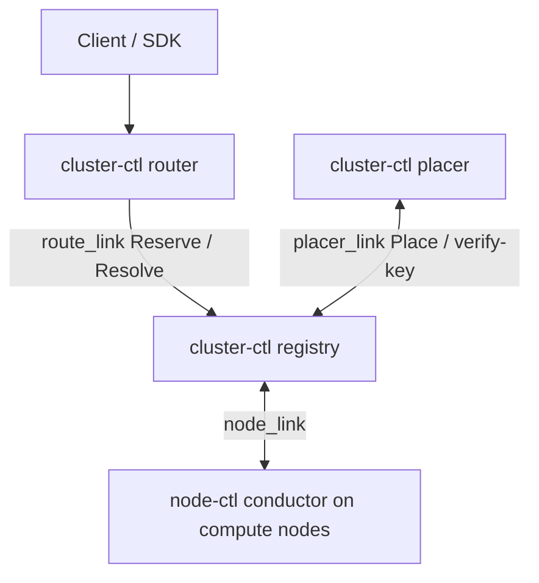
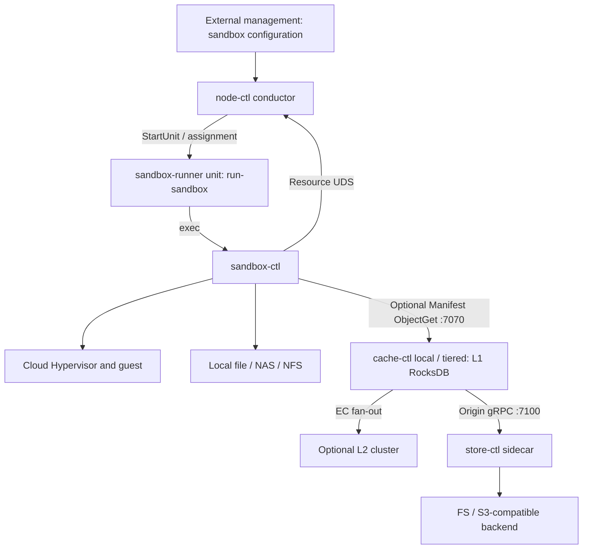
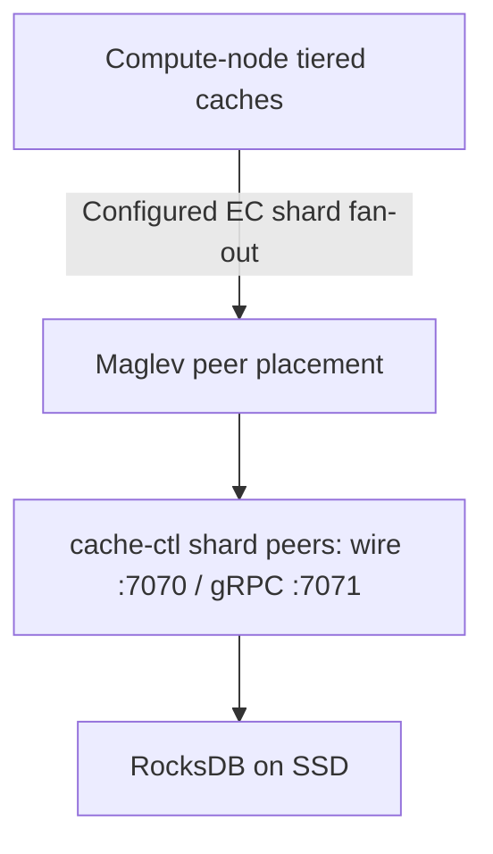

[English](deployment.md) | [简体中文](deployment_zh.md)

<a id="deployment--部署拓扑与组件清单"></a>

# deployment — deployment topology and component inventory

The platform consists of independently deployed processes communicating through gRPC, the cache wire protocol, vsock and Unix domain sockets (UDS). This operations/SRE guide defines process ownership, responsibilities, configuration entry points and startup/shutdown dependencies.

Each component's design document owns its CLI, configuration schema and internal behavior. This guide explains where processes run, how they find one another and their ordering dependencies.

<a id="1-角色概览"></a>

## 1. Role overview

Select roles according to the data path and control-plane topology. Local files, shared files and Manifest/store/cache are separate choices; Manifest and caching are not prerequisites for either standalone or cluster deployment.

**Node and cluster roles**

| Role | Responsibility | Main processes |
|---|---|---|
| Compute Node | Hosts MicroVMs and node resource control; E2B template builds also run in build sandboxes on this node (§5). | `node-ctl conductor serve`, optionally with `resource_listen`; independent Proxy master and workers; `sandbox-ctl × N`. Deploy `cache-ctl` when selected for the Manifest path, and `store-ctl` when source access, publication or configured write admission requires it. |
| Shared Storage | Native cross-node file access for named `file://` locations. | Operator-provided NAS, NFS or shared filesystem. |
| L2 Cache Cluster (optional) | Distributed EC caching for the Manifest path; without it, cache can hit locally or read the origin. | `cache-ctl shard`. |
| Cluster Control Plane (optional) | E2B-compatible multi-node control: registry maintains execution state, router supplies the common entry point, and placer imports groups and selects placement. Nodes still execute lifecycle operations. | `cluster-ctl registry`, `cluster-ctl router`, `cluster-ctl placer`. |

**External shared resources**, operated outside the platform:

| Resource | Purpose |
|---|---|
| Local/NAS/NFS | Local or shared native-file artifacts, without mandatory conversion to content chunks. |
| FS or S3-compatible store | Durable backend for Manifests and chunks. |
| Platform management plane | Instance scheduling, configuration, tenancy and template-build credentials (registry pull tokens/customer keys). Imports sandbox-group configuration through the cluster placer/provider, or calls the standalone `node-ctl` E2B API directly. |
| Container registry | Tenant image source, pulled as needed by `flatten-ctl` in the build sandbox; supports OCI 1.1 Referrers. |

## 2. Compute Node

<a id="21-常驻进程"></a>

### 2.1 Resident processes

| Process | Role | Count | Lifecycle | Owner |
|---|---|---|---|---|
| `node-ctl conductor serve` | Local orchestration, E2B-compatible control plane, optional node resource arbitration and node-link client. Drives sandbox-ctl through `sandbox-runner@<run-id>` and `sandbox-builder@<run-id>`. The independent Proxy owns sandbox data ingress; conductor does not serve the data plane. | One conductor per node. | systemd. | [orchestrator/node](https://github.com/kuasar-sandbox/orchestrator/blob/main/docs/node.md); resource protocol in [node-resource](https://github.com/kuasar-sandbox/orchestrator/blob/main/docs/node-resource.md). |
| `node-ctl proxy serve` | Master subscribes to routes and conductor-owned MMDS policy over config-socket, binds data/MMDS listeners and manages workers. Workers read fixed routes through mmap and query mutable MMDS routes/values/services through local master RPC; they authenticate and proxy data traffic, including the native exec gate. | One master plus configured `workers`. | systemd. | [orchestrator/node-proxy](https://github.com/kuasar-sandbox/orchestrator/blob/main/docs/node-proxy.md). |
| `cache-ctl` (`mode: local|tiered`, optional) | Manifest read entry: local L1, optional EC L2 and store origin. | Commonly one per selected cache configuration; separate domains can use separate instances. | systemd; start before consumers of this Manifest path. | [accelerator/cache](https://github.com/kuasar-sandbox/accelerator/blob/main/docs/cache.md). |
| `store-ctl` (optional) | Node-side read/write service for FS/S3-compatible Manifest storage. | Commonly one sidecar per node/storage configuration. | systemd; required when selected source access, publication or configured write admission uses Store (§5). | [accelerator/store](https://github.com/kuasar-sandbox/accelerator/blob/main/docs/store.md). |
| `sandbox-ctl run` | Controls one sandbox, similar in lifecycle to `runc run`; not a shared daemon. | One per sandbox. | Assigned by node-ctl through `sandbox-runner@<run-id>` and its `run-sandbox` launcher. | [sandboxer/sandbox](https://github.com/kuasar-sandbox/sandboxer/blob/main/docs/sandbox.md). |
| `cloud-hypervisor` | Patched VMM, child of sandbox-ctl. | One per sandbox. | Spawned by sandbox-ctl. | [sandboxer/cloud-hypervisor](https://github.com/kuasar-sandbox/sandboxer/blob/main/docs/cloud-hypervisor.md). |

<a id="22-端口与套接字"></a>

### 2.2 Ports and sockets

Bind node-local storage, cache and control services to loopback or UDS. Public API/data listeners and L2 peer listeners are deliberate exceptions. The addresses below are deployment examples/conventions; the selected configuration determines actual listeners.

| Process | Listener | Protocol | Purpose |
|---|---|---|---|
| `store-ctl` | `127.0.0.1:7100` | gRPC | Persistent-object reads, write admission and writes for local clients; the Store specification owns the RPC schema. |
| `store-ctl` | `127.0.0.1:7061` | gRPC health | Probes. |
| `cache-ctl tiered` | `127.0.0.1:7070` | Custom binary TCP wire | sandbox-ctl/manifest-ctl chunk reads. |
| `cache-ctl tiered` | `127.0.0.1:7071` | gRPC | Health, `ping`, `info`. |
| `node-ctl conductor serve` (`resource_listen`) | `/run/sandbox-resource.sock` | Resource protocol over UDS | sandbox-ctl resource-controller dial target. |
| `sandbox-ctl` | `<run_root>/sandboxes/<sid>/*.sock` for node-managed sandboxes | UDS | `ch.sock`, `blk{0,1}.sock`, `uffd.sock`, `ctl.sock`, `vsock.sock` and `_5000`; `<sid>.pid` authenticates the task on config-socket. Assignment/launch parameters come through config-socket, not an `SANDBOX_ARGS` envfile. |
| `node-ctl conductor serve` | `api.listen`, e.g. `:443` | HTTPS/h2 | Public E2B control API; the independent Proxy supplies the separate data entry. |
| `node-ctl proxy serve` | `proxy.yaml.data_listen` | HTTPS/h2 or h2c | Separate data entry. Master binds the listener and passes FDs to workers. Native exec uses CONNECT with `service=exec` and `X-Access-Token`. |
| Proxy master/workers | Conductor `mmds.listen`, default `127.0.0.1:19254` | HTTP/1.1 | Target of vswitch `--mgmt-service`. The master receives trusted conductor policy, binds the listener and passes its FD to workers. |
| MMDS local service | `mmds.services.<name>.endpoint` | HTTP/1.1 over UDS | Conductor-only registry; V1 requires an absolute `unix://` path. Workers obtain a permitted resolved socket path from their master. |
| `node-ctl conductor serve` | `/run/sandbox/node-ctl.socket` | HTTP/h2c and framed JSON streams over UDS | Five config-socket planes: run/task/admin/plugin/api. Launchers obtain task/launch/build specifications; admin manages Manifest keys and sandbox MMDS values; external proxy/platform extensions register and synchronize permitted routes over the plugin plane. Authentication uses SO_PEERCRED and task/runner/admin/plugin pidfiles. |

Tiered cache dials L2 peer port `7070` through the node network (§3). Local cache or direct store access does not require L2. `node-ctl proxy serve` starts one master and the configured workers. Data traffic enters `proxy.yaml.data_listen`; control traffic remains at conductor `api.listen`.

External workers require node-local `proxy.yaml.paths.run_root`. They derive `<run_root>/sandboxes/<NodeSandboxID>/ctl.sock`; routesync Policy and the shared-memory route view do not carry this root. Proxy YAML does not duplicate `mmds_listen` or `services`: conductor's trusted `proxy + route_wake + mmds` registration is their sole projection channel. Other node-local services use loopback/UDS.

Conductor starts sandbox-ctl through the **`sandbox-runner@<run-id>.service` template**. Builds use **`sandbox-builder@<run-id>.service`**, with at most one phase MicroVM active at a time. Conductor generates/installs both templates at startup unless `install_units: false` delegates their management to the operator. Assignment and process lifetime belong to [Node §5](https://github.com/kuasar-sandbox/orchestrator/blob/main/docs/node.md#5-process-management-through-systemd-template-units); builder task preparation, execution and publication belong to [Build](https://github.com/kuasar-sandbox/orchestrator/blob/main/docs/node-build.md).

The sandbox's `ctl.sock` serves snapshot and local `sandbox-ctl exec --sandbox-id <sid> -- CMD` operations. For a node-managed sandbox, the local client must use the effective sandbox root, e.g. `--run-root /run/sandbox/sandboxes`, to find that socket. Remote clients use the authenticated Proxy entry with an explicitly acquired ExecAccessToken; the UDS stays local. The [sandbox CLI](https://github.com/kuasar-sandbox/sandboxer/blob/main/docs/sandbox.md) and [Proxy contract](https://github.com/kuasar-sandbox/orchestrator/blob/main/docs/node-proxy.md) own token binding, CONNECT headers and frame validation.

<a id="23-持久化与运行时目录"></a>

### 2.3 Persistent and runtime directories

With node roots `/run/sandbox` and `/var/lib/sandbox`, the current node-managed layout is:

| Path | Contents |
|---|---|
| `/var/store/` | store-ctl FS backend on local/shared storage. |
| `/var/cache/accel-l1/` | local/tiered L1 RocksDB, sized for the working set. |
| `/run/sandbox/runners/<run-id>.pid` | Runner/build execution pidfile. |
| `/run/sandbox/sandboxes/<sid>/` | Sandbox sockets, task pidfile/configuration and temporary CH metadata staging (`snap-stage`/`snap-state`); tmpfs. |
| `/var/lib/sandbox/sandboxes/<sid>/` | Persistent sandbox state, including `<sid>.overlay.diff` and `checkpoint/`. |
| `/run/sandbox/builds/<BuildID>/` | Build pidfile and phase runtime directories/sockets; the complete validated BuildID is the directory name. |
| `/var/lib/sandbox/builds/<BuildID>/checkpoint/` | Build image and snapshot artifacts. |
| `/var/lib/sandbox/node-ctl.db` | Default conductor SQLite database (`db_path`). |

`paths.run_root` is for small volatile state and sockets; `paths.base_root` holds larger disk-backed state. The resource controller rebuilds live accounting from inventory/reports; deprecated `resource_listen.state_path` is ignored and is not a resource `state.json` persistence mechanism. Audit output, when configured, is separate.

Direct sandbox-ctl uses its supplied `--run-root`/`SANDBOX_RUN_ROOT` and `--base-root`/`SANDBOX_BASE_ROOT`, with PathID as the directory leaf. Conductor passes the derived `sandboxes/` roots for ordinary sandboxes. Thus standalone `/run/sandbox/<sid>` examples cannot be copied unchanged into a node-managed deployment. Writable overlays belong on disk, while snapshot outputs are selected by `--output` or the orchestrator's checkpoint path. See [nodepath](https://github.com/kuasar-sandbox/orchestrator/blob/main/internal/nodepath/path.go).

<a id="24-节点共享资源目录"></a>

### 2.4 Shared node resources

Maintain named shared inputs instead of provisioning a private copy for each sandbox:

| Example path | Use |
|---|---|
| `/opt/sandbox/kernel/<ver>/vmlinux` | Coexisting kernel versions selected through sandbox configuration. |
| `/opt/sandbox/runtime/<ver>/sandbox-runtime.bundle` | Coexisting runtime versions. |
| `/opt/sandbox/overlay-templates/overlay-1g.ext4` | Preformatted 1 GiB ext4 template. |
| `/opt/sandbox/overlay-templates/overlay-4g.ext4` | Preformatted 4 GiB ext4 template. |
| `/opt/sandbox/overlay-templates/overlay-16g.ext4` | Preformatted 16 GiB ext4 template. |

Example `SANDBOX_CONFIG`:

```yaml
boot:
  kernel:  file:///opt/sandbox/kernel/6.1.169-sandbox/vmlinux
  runtime: file:///opt/sandbox/runtime/v1/sandbox-runtime.bundle
  root:
    overlay:
      # Omitted diff uses the effective base root and PathID; see §2.3.
      diff_template: file:///opt/sandbox/overlay-templates/overlay-1g.ext4
```

**Provisioning:** the configured runtime/kernel files are shared inputs, not per-sandbox copies. Runtime virtio-pmem/DAX can share immutable backing pages through host page cache. Loading one shared kernel file does not mean all guests share one resident kernel working set; each guest has its own execution state.

The overlay is a private writable disk. If `diff` is omitted, sandbox-ctl owns a new diff under its effective disk-backed base directory. A `diff_template` seeds it from the template's logical sparse contents, applying configured active-diff encryption when enabled; node-ctl need not `cp` the template. An existing nonempty explicit diff is opened according to its format/policy and remains caller-owned. An absent explicit path can also be provisioned from the configured template/base; an existing empty diff is rejected. See [PrepareDiff](https://github.com/kuasar-sandbox/sandboxer/blob/main/pkg/sandbox/overlaydiff.go) and [active-diff storage](https://github.com/kuasar-sandbox/sandboxer/blob/main/pkg/vhost/diff_file.go).

<a id="25-per-sandbox-配置下发"></a>
### 2.5 Per-sandbox configuration delivery

Conductor owns node records and validated launch policy; runner and builder processes obtain exact task specifications through the node-local config socket. Use the configured RunRoot/BaseRoot and installed unit templates consistently. Host root and the daemon UID are trusted; guests must not reach this socket.

Protect generated sandbox and build-phase YAML, written with mode `0600`, according to its contents: user-provided launch environment can be confidential. Credential updates affect later record inserts; they do not rebind credentials already copied into durable sandbox/build records. The node credential contract owns that lifecycle.

The [node specification](https://github.com/kuasar-sandbox/orchestrator/blob/main/docs/node.md#6-local-control-socket-run-task-admin-plugin-and-api-planes) owns authentication, assignment and bootstrap/finalization schemas. The [Build specification](https://github.com/kuasar-sandbox/orchestrator/blob/main/docs/node-build.md) owns builder task preparation and execution. Do not expose this internal socket as a public API.

<a id="26-mmds-route-安全与部署边界"></a>
### 2.6 MMDS route security and deployment boundaries

Conductor configuration is the sole authority for `mmds.listen`, allowed routes and local services. Start and register the independent Proxy before admitting requests that need that data/MMDS path. Bind the MMDS listener in the configured network namespace and point vSwitch management traffic to that listener. Local services use explicitly configured absolute Unix-socket URIs; do not expose their host sockets to guests.

The [Proxy MMDS contract](https://github.com/kuasar-sandbox/orchestrator/blob/main/docs/node-proxy.md#7-mmds) owns request identity, route matching, secret handling, header filtering and forwarding restrictions; [Build](https://github.com/kuasar-sandbox/orchestrator/blob/main/docs/node-build.md) owns build-scoped registration and terminal cleanup. Public API TLS/authentication, local socket permissions, guest-isolated networking and service credentials must be configured together. Avoid a second service registry in proxy YAML.

## 3. L2 Cache Cluster

L2 is optional acceleration for the Manifest path. Use local cache plus origin alone, or deploy shards according to working set and failure domains. It does not participate in native local/named shared-file reads.

<a id="31-集群规格"></a>

### 3.1 Cluster specification

- **Size:** choose from measured working set, desired hit rate, SSD capacity, networking and failure domains.
- **Encoding:** `data_shards: 4, parity_shards: 1` encodes each chunk as five shards when enough peers are available.
- **Placement:** Maglev deterministically selects the ordered peer set from chunk hash, using `LocateN(key, 5)`/the EC router's peer-selection path. A true RS 4+1 deployment needs at least five peers. Initial construction clamps an oversized scheme to available peers, so a smaller pool must not be described as still providing 4+1. Inspect the effective scheme and startup log. Adding peers does not replace the placement algorithm; see cache.md §4.9.
- **Resources:** size SSD, RocksDB BlockCache (`mem_ratio`) and networking from deployment measurements.
- **Isolation:** image-chunk and snapshot-chunk domains can use separate cluster instances with different RocksDB paths and membership.
- **Persistence:** RocksDB under e.g. `/mnt/ssd/accel-l2` can retain cached data across a daemon restart. Cache remains reconstructible; this does not promise survival of every crash, storage failure or unsynced write.

<a id="32-端口"></a>

### 3.2 Ports

| Process | Listener | Protocol | Purpose |
|---|---|---|---|
| `cache-ctl shard` | `0.0.0.0:7070` | wire | Shard PUT/GET from compute-node tiered cache. |
| `cache-ctl shard` | `0.0.0.0:7071` | gRPC | Health and `info`. |

Shard mode neither reads L3 nor holds origin credentials. It is a KV service; peers do not require a shard leader.

<a id="33-成员变更"></a>

### 3.3 Membership changes

Each compute node's tiered YAML lists `tiers[].cluster.peers`. Adding/removing a peer is a compute-side **configuration change plus SIGHUP**, rebuilding the Maglev table. The affected keys depend on the old/new membership; do not assume a universal exact `1/M` movement ratio. Surviving peers can return existing framed shards by their recorded shard index.

**Change one peer at a time.** Changing two or more peers can lose more than the single parity allowance of a 4+1 key, producing an L2 miss and falling through to origin. Confirm convergence/hit behavior before the next change; one-at-a-time operations are a precaution, not an unconditional no-miss guarantee. Shard nodes themselves remain KV servers and do not need the membership list.

<a id="4-外部持久化与管理资源"></a>

## 4. External persistence and management resources

<a id="41-存储后端"></a>

### 4.1 Storage backends

Local/named shared-file artifacts are carried directly by the filesystem. For Manifest data, store-ctl supports FS and S3-compatible backends: FS root can be local or shared, and S3-compatible storage can use one or multiple buckets. Operators choose capacity, failure domains and sharing scope. Store-ctl owns its internal paths; see store.md.

S3-compatible access uses deployment configuration or the SDK default credential chain. Origin credentials stay in trusted host services, outside guests and documentation examples. Each node may run a store-ctl sidecar against the same durable backend; FS can also use a node-local directory.

<a id="42-外部管理面接口"></a>

### 4.2 External management interface

The region-level management plane is independently operated outside this project:

- In multi-node deployments, it imports sandbox-group configuration, selectors, customer-key references and template-build credentials through placer/provider.
- In standalone deployments, it can call the node-ctl E2B API and supply the configuration contract in §2.5, adding content-protection configuration when using Manifest data.
- An externally supplied node bridge/agent is not part of these release assets and does not redefine this guide's processes, configuration or dependencies.

Builds run in compute-node build sandboxes (§5); there is no separate flatten management/data pool.

<a id="5-image-builds-three-phases-inside-build-sandboxes"></a>
<a id="5-镜像构建构建沙箱内三阶段"></a>
<a id="51-three-phase-pipeline"></a>
<a id="51-三阶段流水"></a>
<a id="52-final-publication-platform-storage-credentials"></a>
<a id="52-收尾上传平台凭据唯一出现点"></a>
<a id="53-credentials-and-isolation"></a>
<a id="53-凭据与隔离"></a>
## 5. Build deployment

Builds are executed on compute nodes by conductor-assigned `sandbox-builder@<run-id>` units. A builder runs target-selected sandbox phases sequentially, with at most one phase MicroVM active at a time. The public template API, target selection, Build resource admission, exact task messages, steps, publication and recovery are specified together in [node-build.md](https://github.com/kuasar-sandbox/orchestrator/blob/main/docs/node-build.md).

For deployment, provide the guest Runtime/Kernel and flattening tools, a guest-reachable OCI registry when importing images, and the selected durable output path. Image publication requires its configured Store or named-file carrier; native-file snapshots do not imply a mandatory object-store conversion. COPY contexts require the configured object-storage service and presigned-upload access, not a public upload proxy in conductor.

Manifest Store publication requires Store. Source access requires its selected Cache/Store or file/Bundle dependencies. Named-location Bundle publication can run without `store-ctl` when the source graph is fully file/Bundle-resolvable and offline write admission is valid. A configured Store endpoint must still satisfy write admission; failure does not fall back offline. The [Manifest admission contract](https://github.com/kuasar-sandbox/accelerator/blob/main/docs/manifest.md) and Build publication rules determine the selected dependencies.

Use independently scoped registry-pull and artifact-publication credentials. Keep host content-protection material out of guest workloads. Configure per-build registry trust, node-local paths, builder units and aggregate resource limits according to the Build contract; do not infer a universal three-phase run from the presence of `startCmd`. Delay build admission until conductor, required storage services and the guest-reachable network are ready.

## 6. Cluster Control Plane (cluster-ctl)

For multiple compute nodes, three roles compose the cluster layer: **registry**, a state cluster and node-channel hub; **router**, the common E2B control/data entry; and **placer**, the group provider/importer and placement scheduler. Their independent contracts own routing, activation and authentication. See [cluster.md](https://github.com/kuasar-sandbox/orchestrator/blob/main/docs/cluster.md). A standalone node directly serving the E2B SDK does not require this layer.



<a id="61-进程"></a>

### 6.1 Processes

| Process | Role | Count | Lifecycle | Owner |
|---|---|---|---|---|
| `cluster-ctl registry` | Replicated `route_link`, `node_link`, `node_list`, `placer_link` execution state; node connections and route/node owner RPC. | One or more members; LocateN selects each group/node owner set. | systemd. | cluster.md. |
| `cluster-ctl router` | E2B control/data entry (`api.<domain>`) and recent route cache; consult the Router specification for operation-specific resolution, activation, authorization and forwarding. | Multiple stateless replicas behind LB. | systemd. | [cluster-router.md](https://github.com/kuasar-sandbox/orchestrator/blob/main/docs/cluster-router.md). |
| `cluster-ctl placer` | Group provider/importer, WATCH_LIST consumer and scheduler; PlaceSandbox/PlaceBuild/verify-key for registry. | Multiple replicas; deterministic group failover uses ready placer memberlist view. | systemd. | [cluster-placer.md](https://github.com/kuasar-sandbox/orchestrator/blob/main/docs/cluster-placer.md). |

Small deployments can colocate all three. Larger ones scale registry membership, router entry replicas and placer replicas separately.

<a id="62-端口"></a>

### 6.2 Ports

| Process | Listener | Protocol | Purpose |
|---|---|---|---|
| Router | `:443` | HTTPS/h2 | Public E2B control/data entry for the cluster. |
| Registry | `member.listen`, e.g. `:7700` | JSONRPC over HTTP/h2c or HTTPS | Unified control plane with `/node-link/*`, `/route-link/*`, `/placer-link/*`, `/cluster/membership`, `/internal/registry-member/*`, `/internal/memberlist/*`. |
| Registry | Optional `node_link.listen` | JSONRPC over HTTP/h2c or HTTPS | Separate node-connection listener; empty reuses member.listen. |
| Placer | `placer.listen`, e.g. `:7800` | JSONRPC over HTTP/h2c or HTTPS | Place/verify-key API; memberlist HTTP transport shares the listener. |

<a id="63-与节点--平台管理面的关系"></a>
### 6.3 Relationship to nodes and external management

Nodes establish authenticated node-link sessions with Registry and advertise their API and data endpoints explicitly. Router connects to Registry for group-scoped state and to the chosen node for control/data forwarding. Placer imports groups from its configured Provider and proposes placement; node admission remains authoritative for resources.

Deploy Router and Placer behind the appropriate ingress/discovery configuration, and keep their Registry bootstrap and advertised endpoints reachable. The [Registry protocol](https://github.com/kuasar-sandbox/orchestrator/blob/main/docs/cluster.md), [Router behavior](https://github.com/kuasar-sandbox/orchestrator/blob/main/docs/cluster-router.md), and [Placer contract](https://github.com/kuasar-sandbox/orchestrator/blob/main/docs/cluster-placer.md) own Resolve/Reserve schemas, caching, activation and retry semantics. This deployment guide does not duplicate those state machines.

<a id="64-故障域"></a>

### 6.4 Failure domains

| Failure | Impact | Recovery |
|---|---|---|
| One registry member crashes. | Its logical shards lose one replica; writes continue only with quorum. | Quorum reads/read-repair catch up after recovery. Already routed sessions can continue without a fresh registry lookup, subject to their existing node/transport connections. |
| Entire registry is powered off, shard data retained. | Reserve/Place unavailable during outage. | Read retained data after quorum returns; node-link reconnects and converges. |
| Execution shards are irrecoverably lost. | Do not reconstruct live sandbox/build node execution state from a stale backup. | Recover provider data through its durability process. Live-node projection recovery and migration-token durable routes remain tracked by [#34](https://github.com/kuasar-sandbox/orchestrator/issues/34)/[#33](https://github.com/kuasar-sandbox/orchestrator/issues/33); report unavailable recovery explicitly until implemented. |
| Router crashes. | Connections through that replica break. | LB selects another stateless replica. |
| Placer crashes. | It leaves the ready set; cold placement fails over to another placer for the same group. | Hot routing is unaffected; Registry tries another candidate after Place timeout. |
| A compute node loses node-link. | Registry temporarily lacks its current view. | Node reconnects/reports. After node_dead_after, node_list expires it and placer stops selecting it; orphan cleanup uses group+sandbox_id. |

<a id="7-全景拓扑"></a>

## 7. Overall topology

The following views separate process/data, L2 and build relationships. External endpoints represent another role or the region-level service.

### 7.1 Compute Node



### 7.2 L2 Cache Cluster



For an effective RS 4+1 scheme, placement selects five peers per chunk. Origin credentials and origin access remain at each compute node's store-ctl; shards do not receive them.

### 7.3 Image Build (in-sandbox, on Compute Node)

```text
Platform / E2B client
        │ template API
        ▼
Conductor ──► assigned Builder unit
                     │ sequential phase MicroVMs
                     ├──► guest-reachable registry / COPY storage
                     └──► selected artifact publication backend
```

This is a deployment relationship, not a fixed phase-count or publication algorithm. See [Build execution and publication](https://github.com/kuasar-sandbox/orchestrator/blob/main/docs/node-build.md).

<a id="8-启停依赖"></a>

## 8. Startup and shutdown dependencies

<a id="81-启动顺序"></a>

### 8.1 Startup order

**External dependencies, according to the deployment**

1. Mount and verify local/shared-file paths. Make the selected source and publication backends available (§5), including FS/S3-compatible Store where configured.

**Optional L2, before its compute consumers**

2. Start and health-check the configured shard members.
3. Distribute their `tiers[].cluster.peers` list to compute configurations.

**Compute nodes, independently**

4. If required, start store-ctl and verify active generation initialization and gRPC health.
5. If selected, start local/tiered cache. For tiered mode verify configured L2 peers and store origin reachability.
6. Start conductor, including configured resource_listen, and recover/reconcile node state. Accept new sandboxes through standalone E2B or after registry attachment. Start and verify the independent Proxy master/workers' trusted registration before admitting work that depends on their data entry.

Tiered cache does not need every L2 peer online to start: clean misses may fall through, while backend/protocol failures retain the Cache contract's explicit error behavior. The write path, manifest-ctl directly using store-ctl, fails when the selected durable backend/store is unavailable.

Builds reuse conductor. Accept builds after conductor, the selected source/publication backends and any configured Store write-admission endpoint are ready (§5).

<a id="82-关闭顺序自顶向下"></a>

### 8.2 Shutdown order, from consumers to providers

1. Stop external management/cluster/client admission of new sandbox and build work to the node.
2. Drain existing work and explicitly wait for exit or complete requested snapshots before stopping conductor. SQLite preserves recorded lifecycle state; resource accounting is reconstructed after restart, not saved as resource state.json. Sending SIGTERM alone is not an instruction to snapshot every guest.
3. If deployed, stop cache-ctl with SIGTERM and allow its normal in-flight handling and RocksDB shutdown to complete.
4. Stop store-ctl last.

L2 shutdown has no strict ordering against compute shutdown; each tiered client handles L2 unavailability according to the Cache error/fallback contract; an arbitrary failure is not automatically a clean miss.

<a id="9-故障域"></a>

## 9. Failure domains

| Failure | Direct impact | Recovery |
|---|---|---|
| Compute-node store-ctl crashes. | Local Manifest origin reads/writes stop; L1/L2 hits and native-file paths are unaffected. | systemd restart restores origin access. |
| Compute-node tiered cache crashes. | New sandbox faults requiring wire access wait/fail under client timeout/cancellation behavior. | systemd restarts it; persisted RocksDB data can restore L1 hits. Cache misses still fall through normally. |
| One shard fails under effective RS 4+1. | L2 can reconstruct from any four **distinct shard indices** among the selected five, if those shards are available. | Restart the shard. A peer outage does not automatically rewrite Maglev membership or create an extra parity peer. |
| At least two shards for one 4+1 key are unavailable. | Fewer than four distinct valid shards cause an L2 miss. | Read through origin, with added cost. Change membership one peer at a time and verify convergence. |
| Conductor crashes. | API/admission and new launches stop; existing sandboxes retain their last grants. | Restart and reconcile SQLite (`db_path`, default `<base_root>/node-ctl.db`) with live `sandbox-runner@*.service` units. Adopt active/running sandboxes and rearm TTL; mark running records without units dead; retain paused/snapshot records for connect/auto-resume. Resource inventory and reports reconstruct accounting; deprecated state_path is ignored. |
| S3-compatible origin unavailable. | Manifest operations needing that origin fail or wait according to their policies. | L1/L2 hits can continue. New origin writes, cold faults and final image upload are affected; independent local/shared-file paths are unaffected. |
| Entire compute node fails. | Running sandboxes on that node stop. | Isolate the node. Cluster can import portable paused artifacts published to named shared files/Manifest on another node; local-only artifacts still depend on the original node/storage. |
| L2 loses more than its parity allowance. | Affected keys miss in L2. | Tiered reads continue through origin where available; cache service resumes as peers/data recover. |

<a id="10-部署规模示例"></a>

## 10. Deployment examples

<a id="101-开发--poc单机"></a>

### 10.1 Development / PoC (one host)

| Process | Example configuration |
|---|---|
| store-ctl | FS backend at `/var/store`. |
| cache-ctl | `mode: local`, no L2. |
| sandbox-ctl × N | Manual runs may omit conductor. |

This example uses no L2, remote object store or separate resource-controller daemon. Resource arbitration is integrated into conductor; without resource_listen, use static cgroup limits. Manifest-ctl uses local store/cache; see cache.md §3.2. For an unmodified E2B SDK, run conductor as the standalone API; the cluster layer remains unnecessary.

<a id="102-生产单-az"></a>

### 10.2 Production in one AZ

| Dimension | Selection |
|---|---|
| Compute | Peak working set, active ratio, restore cost and safety margin. |
| Storage | Local NVMe / NAS / NFS / FS or S3-compatible store. |
| Optional cache | Local cache or L2 shards sized by hit rate and failure domain. |
| Control plane | Standalone node-ctl or registry + router + placer. |

Each compute node runs conductor and one sandbox-ctl per active sandbox. Add store and optional cache for Manifest data. Measure node count, per-node concurrency and cache capacity using the target versions, hardware, sandbox specifications and workload; architecture diagrams do not establish fixed capacity. For cluster mode, choose registry membership and LB-backed router/placer replicas according to availability and load.

<a id="103-多-az"></a>

### 10.3 Multiple AZs

Each AZ can run its own compute and optional L2 and select shared storage/S3-compatible failure domains. Tiered compute typically prefers same-AZ peers to reduce cross-AZ hot-path traffic. Cross-AZ content sharing depends on content keys, security domains and backend configuration; equal bytes alone do not authorize cross-tenant or cross-domain sharing.

<a id="11-配置入口速查"></a>

## 11. Configuration entry points

Full schemas belong to the owning component documents; these are entry pointers.

| Process | Configuration | Deployment convention | Schema |
|---|---|---|---|
| store-ctl | `--config <path>` | `listen: 127.0.0.1:7100`. | [store.md](https://github.com/kuasar-sandbox/accelerator/blob/main/docs/store.md) §3; archive `docs/store.md`. |
| tiered cache-ctl | `--config <path>` | `listen: 127.0.0.1:7070`; selected `tiers[].cluster.peers`. | [cache.md](https://github.com/kuasar-sandbox/accelerator/blob/main/docs/cache.md) §3.4; archive `docs/cache.md`. |
| shard cache-ctl | `--config <path>` | `listen: 0.0.0.0:7070` for peers. | cache.md §3.3. |
| conductor | `/etc/node-ctl/conductor.yaml` | `mmds.listen/routes/services` is MMDS's sole source; services use absolute unix:// paths. | [node.md](https://github.com/kuasar-sandbox/orchestrator/blob/main/docs/node.md) §3/§4.6; node-proxy.md §7. |
| external proxy | `/etc/node-ctl/proxy.yaml` | Data listener/worker/shm bootstrap; no duplicate MMDS listen/services. | [node-proxy.md](https://github.com/kuasar-sandbox/orchestrator/blob/main/docs/node-proxy.md) §2. |
| conductor resource controller | Inline `resource_listen` in conductor.yaml. | `socket: /run/sandbox-resource.sock`. | [node-resource.md](https://github.com/kuasar-sandbox/orchestrator/blob/main/docs/node-resource.md) §3; archive `docs/node-resource.md`. |
| registry | `--config /etc/cluster-ctl/registry.yaml` | member.id/listen; membership.active/versions[].members[].advertise/node_advertise/owners; node_link/route_link/node_list/placer_link. | [cluster.md](https://github.com/kuasar-sandbox/orchestrator/blob/main/docs/cluster.md); archive `docs/cluster.md`. |
| router | `--config /etc/cluster-ctl/router.yaml` | registry.bootstrap; public :443 behind LB; requests require X-Kuasar-Sandbox-Group. | [cluster-router.md](https://github.com/kuasar-sandbox/orchestrator/blob/main/docs/cluster-router.md); archive `docs/cluster-router.md`. |
| placer | `--config /etc/cluster-ctl/placer.yaml` | placer.id/listen/advertise/memberlist_label; registry.bootstrap; import_groups[]; placement. | [cluster-placer.md](https://github.com/kuasar-sandbox/orchestrator/blob/main/docs/cluster-placer.md); archive `docs/cluster-placer.md`. |
| sandbox-ctl run | `--config <path>` / SANDBOX_CONFIG; Manifest path adds `--manifest-config`. | Per-sandbox YAML under `<run_root>/sandboxes/<sid>/` when conductor-managed. | [sandbox.md](https://github.com/kuasar-sandbox/sandboxer/blob/main/docs/sandbox.md) §3; archive `docs/sandbox.md`. |
| manifest-ctl | `--manifest-config <path>` / MANIFEST_CONFIG. | Same Manifest schema and store/cache endpoints as sandbox-ctl. | [manifest.md](https://github.com/kuasar-sandbox/accelerator/blob/main/docs/manifest.md) §3; archive `docs/manifest.md`. |
| flatten-ctl | CLI flags; `--manifest-config` / MANIFEST_CONFIG for upload; `--config` / FLATTEN_CONFIG for flatten settings; credentials in FLATTEN_REGISTRY_* env. | Runs inside the build guest through the runtime bundle, driven by run-builder (§5). | [flatten.md](https://github.com/kuasar-sandbox/guest-runtime/blob/main/docs/flatten.md) §2; archive `docs/flatten.md`. |

For build outputs, architecture selection and component/aggregate releases, see [README](../README.md) and [release.md](release.md). For archive extraction and E2E, see [full validation](../test/QUICKSTART.md). Measurement and regression methodology are in [perf.md](perf.md).

## 12. See also

- [System overview](kuasar-sandbox.md): goals, subsystem ownership and end-to-end data flow.
- [sandboxer/sandbox.md](https://github.com/kuasar-sandbox/sandboxer/blob/main/docs/sandbox.md): full compute-node runtime lifecycle; archive `docs/sandbox.md`.
- [accelerator/cache.md](https://github.com/kuasar-sandbox/accelerator/blob/main/docs/cache.md): local/shard/tiered selection (§3.1) and Maglev placement (§4.9); archive `docs/cache.md`.
- [accelerator/store.md](https://github.com/kuasar-sandbox/accelerator/blob/main/docs/store.md): FS/S3-compatible backends and internal storage layout; archive `docs/store.md`.
- [orchestrator/node-resource.md](https://github.com/kuasar-sandbox/orchestrator/blob/main/docs/node-resource.md): node resource protocol; archive `docs/node-resource.md`.
- [orchestrator/node.md](https://github.com/kuasar-sandbox/orchestrator/blob/main/docs/node.md): E2B control and node hosting; [cluster.md](https://github.com/kuasar-sandbox/orchestrator/blob/main/docs/cluster.md): registry/routing/placement.
- [accelerator/manifest.md](https://github.com/kuasar-sandbox/accelerator/blob/main/docs/manifest.md): MANIFEST_CONFIG and loader contract; archive `docs/manifest.md`.
