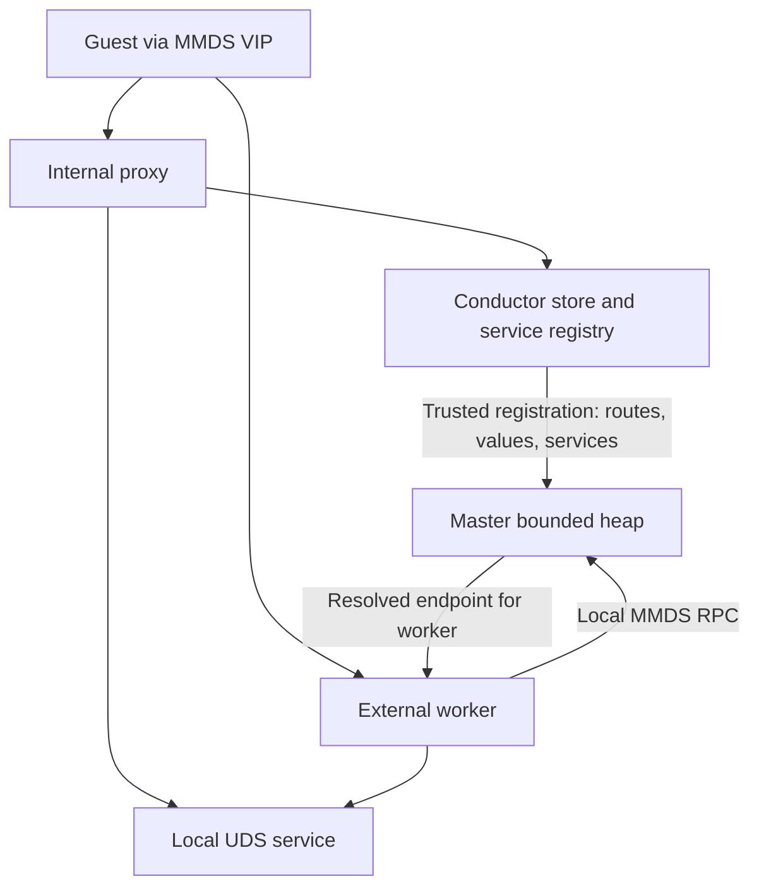
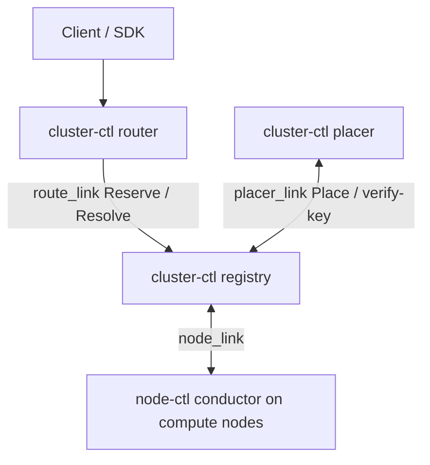
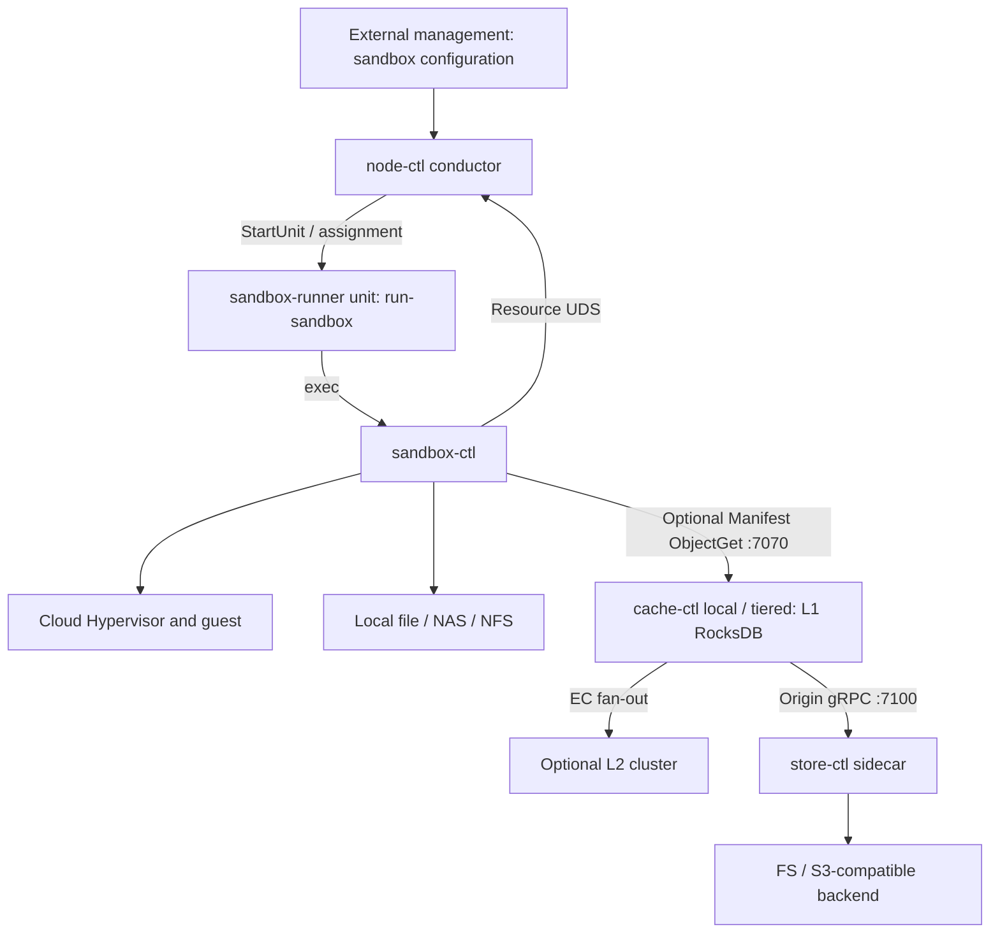
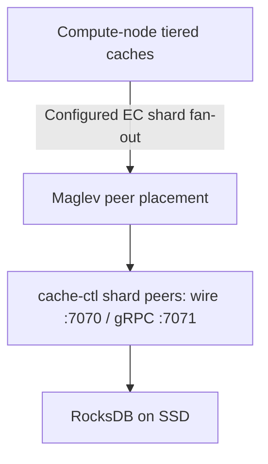
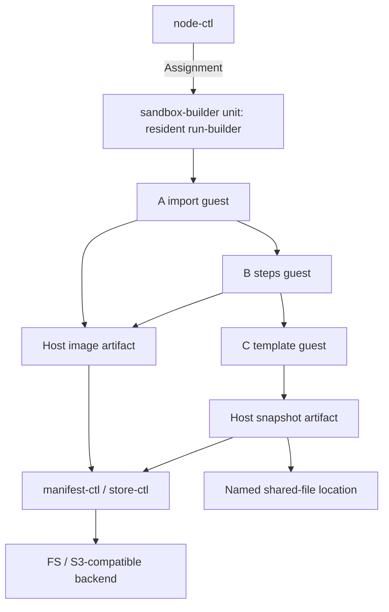

[English](deployment.md) | [简体中文](deployment_zh.md)

# deployment — 部署拓扑与组件清单

kuasar-sandbox 平台由若干**独立部署的进程**组成,通过网络协议(gRPC / wire /
vsock / UDS)协作。本文档定义这些进程在生产部署中的归属、责任边界、配置入口与
启停依赖,供运维与 SRE 使用。

各模块的 CLI、配置 schema、内部设计在自己的文档里(`docs/<模块>.md`);本文档
**不**重复这些细节,只回答"东西在哪、彼此怎么找到对方、谁先起谁后起"。

## 1. 角色概览

部署角色按数据路径和控制面拓扑选择.本地文件,共享文件存储与
Manifest/store/cache 可以分别使用,后两者不是单节点或集群部署的强制前提.

**节点与集群角色**

| 角色 | 职责 | 关键进程 |
|---|---|---|
| Compute Node | 承载 MicroVM 和节点资源控制;e2b 模板构建也在本节点的构建沙箱内进行(§5) | `node-ctl conductor serve`(含可选 `resource_listen`;external proxy 模式另启 master + workers),`sandbox-ctl × N`;Manifest 数据路径按需部署 `cache-ctl`,Manifest 数据路径或产生镜像的构建需要 `store-ctl` |
| Shared Storage | 为命名 `file://` location 提供跨节点原生文件访问 | 部署方提供的 NAS,NFS 或共享文件系统 |
| L2 Cache Cluster(可选) | 为 Manifest 路径提供分布式 EC 缓存,未部署时 cache 可以本地命中或直接回源 | `cache-ctl shard` |
| Cluster Control Plane(可选) | E2B 兼容多节点控制面:registry 维护执行态,router 提供统一入口,placer 导入 group 并放置;生命周期仍由 node 执行 | `cluster-ctl registry`,`cluster-ctl router`,`cluster-ctl placer` |

**外部共享资源**(由部署方运营,平台外)

| 资源 | 用途 |
|---|---|
| Local/NAS/NFS | 本地或跨节点原生文件工件,不要求转换为内容分片 |
| FS 或 S3-compatible store | Manifest 与 chunk 的远程持久化后端 |
| 平台管理面 | 沙箱实例调度、配置、租户管控、模板构建凭据(registry 拉取令牌 / 客户密钥);通过 **cluster 控制面**向 placer/provider 导入 sandbox-group 配置,或在单机部署中直接调用 `node-ctl` e2b API |
| 容器镜像仓库 | 租户镜像来源;构建沙箱内 `flatten-ctl` 按需拉取(OCI v1.1,支持 Referrers) |

## 2. Compute Node

### 2.1 常驻进程

| 进程 | 角色 | 数量 | 启停 | 归属 |
|---|---|---|---|---|
| `node-ctl`(`serve`)| 本机沙箱编排 + e2b 兼容控制面 + 节点级资源仲裁(`resource_listen`)+ node-link 集群接入客户端;经 run-id 模板单元 `sandbox-runner@<run-id>`/`sandbox-builder@<run-id>` 驱动 sandbox-ctl;`proxy.mode=internal` 时还在本进程承载数据面 proxy | 单实例 | systemd | 平台内,[orchestrator/docs/node_zh.md](https://github.com/kuasar-sandbox/orchestrator/blob/main/docs/node_zh.md)(资源协议见 node-resource.md)|
| `node-ctl proxy`(`serve`,external 仅)| proxy master 经 config-socket 订阅路由与 conductor-owned MMDS policy、绑定独立数据/MMDS入口并管理 worker;worker 用 mmap 读取固定路由,经 master 本机 RPC 查询可变 MMDS route/value/service,执行数据面鉴权、反代及 native exec gate | 1 master + `workers` 个 worker | systemd | 平台内,[orchestrator/docs/node-proxy_zh.md](https://github.com/kuasar-sandbox/orchestrator/blob/main/docs/node-proxy_zh.md) |
| `cache-ctl`(`mode: local|tiered`,可选)| Manifest 数据入口:节点本地 L1,可选 EC L2 和 store origin | 通常每个节点/所选配置一个实例;独立域可分实例 | systemd,使用 Manifest 路径时先于 node-ctl | 平台内,[docs/cache_zh.md](https://github.com/kuasar-sandbox/accelerator/blob/main/docs/cache_zh.md) |
| `store-ctl`(可选) | Manifest store 的节点侧 FS/S3-compatible 读写服务 | 通常每个节点/所选配置一个实例;独立域可分实例 | systemd,使用 Manifest 数据路径或执行产生镜像的构建时启动 | 平台内,[docs/store.md](https://github.com/kuasar-sandbox/accelerator/blob/main/docs/store_zh.md) |
| `sandbox-ctl`(`run`) | 单个沙箱的控制平面(类 `runc run`);非 daemon | 每沙箱一个 | 由 node-ctl 经 `sandbox-runner@<run-id>` 单元(`run-sandbox`)assignment 后启动 | 平台内,[docs/sandbox_zh.md](https://github.com/kuasar-sandbox/sandboxer/blob/main/docs/sandbox_zh.md) |
| `cloud-hypervisor` | VMM(patched);`sandbox-ctl` 子进程 | 每沙箱一个 | `sandbox-ctl` 派生 | 平台内,[docs/cloud-hypervisor.md](https://github.com/kuasar-sandbox/sandboxer/blob/main/docs/cloud-hypervisor_zh.md) |

### 2.2 端口与套接字

节点本地存储、缓存和控制服务应绑定 loopback 或 UDS;公开 API/数据入口和 L2 peer
监听是显式例外。下表地址是部署示例/惯例,实际值由所选配置确定:

| 进程 | 监听 | 协议 | 用途 |
|---|---|---|---|
| `store-ctl` | `127.0.0.1:7100` | gRPC | `Put` / `Get` / `GetSalt`(本机 cache-ctl + manifest-ctl 调用)|
| `store-ctl` | `127.0.0.1:7061` | gRPC health | 探针 |
| `cache-ctl tiered` | `127.0.0.1:7070` | wire(自定义二进制 TCP)| 数据面:`sandbox-ctl` / `manifest-ctl` 拉 chunk |
| `cache-ctl tiered` | `127.0.0.1:7071` | gRPC | health / `ping` / `info` |
| `node-ctl conductor serve(resource_listen)` | `/run/sandbox-resource.sock` | UDS,自定义协议 | 沙箱资源协议(`sandbox-ctl` 拨号目标)|
| `sandbox-ctl` | `/run/sandbox/sandboxes/<sid>/*.sock` | UDS | sandbox 内部:`ch.sock` / `blk{0,1}.sock` / `uffd.sock` / `ctl.sock` / `vsock.sock`(+ `_5000`);另写 `<sid>.pid`(config-socket task 鉴别);assignment/launch 参数经 config-socket 交接,不使用 SANDBOX_ARGS envfile|
| `node-ctl`(`serve`) | `api.listen`,如 `:443` | HTTPS/h2 | **对外** e2b 控制面 API;`proxy.mode=internal` 时同一 handler 也承载沙箱数据面,`proxy.data_listen` 可另设数据入口 |
| `node-ctl proxy`(`serve`,external 仅)| `proxy.yaml.data_listen` | HTTPS/h2 或 h2c | **独立数据入口**;master 绑定 listener 并把 fd 交给 workers,native exec 使用 `service=exec` + `X-Access-Token` CONNECT |
| `node-ctl`/external proxy | conductor `mmds.listen`,默认 `127.0.0.1:19254` | HTTP/1.1 | vswitch `--mgmt-service` 的目标;internal 由 conductor 绑定,external 由 master 从可信 Hello policy 取得后绑定并把 fd 交给 workers |
| MMDS local service | `mmds.services.<name>.endpoint` | HTTP/1.1 over UDS | conductor-only registry;V1 为 `unix://` absolute path,internal 直拨,external worker 经 master 取得解析后的 socket path |
| `node-ctl`(`serve`) | `/run/sandbox/node-ctl.socket` | UDS,HTTP/h2c + framed JSON stream | config-socket(run/task/admin/plugin/api 五平面):启动器取 LaunchSpec/BuildSpec;admin 管 manifest key 与 sandbox MMDS value;external proxy/platform agent 经 plugin 平面注册并同步受控路由(SO_PEERCRED + `<id>.pid`/pidfile 鉴别)|

使用 tiered cache 时,EC 客户端通过节点对外网络拨号 L2 cluster 节点的 `7070`
端口(详见 §3);local cache 或直接 store 路径不需要 L2.internal 模式下,conductor
进程内 proxy 与控制面共用 handler;
external 模式下,`node-ctl proxy serve` 启动 1 个 master 和配置数量的 workers,正常数据面流量进入
`proxy.yaml.data_listen`,而控制面仍由 conductor 的 `api.listen` 承载。external worker 使用自身
`proxy.yaml` 中必填的 `paths.run_root` 定位 `<run_root>/sandboxes/<NodeSandboxID>/ctl.sock`;该值是节点本地部署配置,
不经 routesync `Policy` 或共享内存路由视图传递。`proxy.yaml` 不配置 `mmds_listen` 或
`services`;conductor 的 trusted `proxy + route_wake + mmds` registration 是这两项的唯一
投影通道。其余本机进程均使用 loopback/UDS。
`sandbox-ctl` 由 `node-ctl` 经 systemd **模板单元 `sandbox-runner@<run-id>.service`** 拉起
(`StartUnit`/预启动 → 单元内 `run-sandbox` WaitAssignment 后 `execve` 为 `sandbox-ctl run`,非自行 fork-exec)。e2b 模板构建
另走第二个模板单元 **`sandbox-builder@<run-id>.service`**(单元内 `run-builder` WaitAssignment 后
**驻留驱动构建沙箱内的三阶段流水线** import / steps / template,每阶段一台 microVM 作其直接子进程;镜像拉取与 step 执行
都在沙箱内,详见 §5 与 [orchestrator/docs/node_zh.md](https://github.com/kuasar-sandbox/orchestrator/blob/main/docs/node_zh.md) §12)。两个模板单元由
`node-ctl conductor serve` 启动时自动生成并安装(`install_units:false` 则交由运维带外管理),完整设计见
[orchestrator/docs/node_zh.md](https://github.com/kuasar-sandbox/orchestrator/blob/main/docs/node_zh.md) §5/§12。

运维侧:`/run/sandbox/sandboxes/<sid>/ctl.sock` 除了承载 snapshot,也是 `sandbox-ctl exec
--sandbox-id <sid> -- CMD` 的本机入口。受管沙箱的本机客户端还须指定有效根,例如
`--run-root /run/sandbox/sandboxes`,才能定位同一 socket.远程调用不会直接暴露该 UDS:客户端先以
`X-API-KEY` 显式申请绑定 AuthSandboxID 的 `kat1` ExecAccessToken,再由
`sandbox-ctl exec --proxy` 和可重复的 `--proxy-header` 透传 SID、`service=exec`、
token 及 cluster context 并建立 CONNECT;最终 node proxy 验证 token 后拨现有
`ctl.sock`,由 `pkg/ctl.ProxyExec` 限制首帧只能是 `exec_request`.远程客户端由
[`sandboxer#28`](https://github.com/kuasar-sandbox/sandboxer/issues/28)交付,也是
standalone,cluster和external-proxy真实guest E2E的必需客户端;这些测试直接调用该客户端,
不再使用临时 CONNECT bridge.完整规格见
[sandboxer/docs/sandbox_zh.md](https://github.com/kuasar-sandbox/sandboxer/blob/main/docs/sandbox_zh.md) 和 [orchestrator/docs/node-proxy_zh.md](https://github.com/kuasar-sandbox/orchestrator/blob/main/docs/node-proxy_zh.md).

### 2.3 持久化与运行时目录

以节点根 `/run/sandbox` 和 `/var/lib/sandbox` 为例,当前受管布局为:

| 路径 | 内容 |
|---|---|
| `/var/store/` | store-ctl FS 后端,可在本地盘或共享文件系统。 |
| `/var/cache/accel-l1/` | local/tiered L1 RocksDB,按工作集定容。 |
| `/run/sandbox/runners/<run-id>.pid` | Runner/build 执行身份 pidfile。 |
| `/run/sandbox/sandboxes/<sid>/` | socket、task pidfile/配置与临时 CH 元数据 staging (`snap-stage`/`snap-state`),位于 tmpfs。 |
| `/var/lib/sandbox/sandboxes/<sid>/` | 持久状态,包括 `<sid>.overlay.diff` 和 `checkpoint/`。 |
| `/run/sandbox/builds/<BuildID>/` | Build pidfile 与阶段运行目录/socket;目录名使用完整且已校验的 BuildID。 |
| `/var/lib/sandbox/builds/<BuildID>/checkpoint/` | Build 镜像与快照工件。 |
| `/var/lib/sandbox/node-ctl.db` | 默认 conductor SQLite 数据库 (`db_path`)。 |

`paths.run_root` 保存小型易失状态与 socket,`paths.base_root` 保存较大的磁盘数据。
资源控制器从 inventory/report 重建实时记账;已弃用的 `resource_listen.state_path`
被忽略,不再用资源 state.json 持久化。配置的 audit 输出是独立用途。

直接调用 sandbox-ctl 时,`--run-root`/`SANDBOX_RUN_ROOT` 与
`--base-root`/`SANDBOX_BASE_ROOT` 是所传根,PathID 是目录叶子。Conductor 对普通
沙箱传入派生的 `sandboxes/` 根,不能把 standalone `/run/sandbox/<sid>` 示例原样
用于受管部署。可写 overlay 应使用磁盘;快照输出由 `--output` 或 orchestrator 的
checkpoint 路径选择。权威实现见 [nodepath](https://github.com/kuasar-sandbox/orchestrator/blob/main/internal/nodepath/path.go)。

### 2.4 节点共享资源目录

平台维护按名称引用的共享输入,无需逐沙箱复制:

| 示例路径 | 用途 |
|---|---|
| `/opt/sandbox/kernel/<ver>/vmlinux` | 多内核版本并存,由 sandbox 配置选择。 |
| `/opt/sandbox/runtime/<ver>/sandbox-runtime.bundle` | 多 runtime 版本并存。 |
| `/opt/sandbox/overlay-templates/overlay-1g.ext4` | 预格式化 1 GiB ext4。 |
| `/opt/sandbox/overlay-templates/overlay-4g.ext4` | 预格式化 4 GiB ext4。 |
| `/opt/sandbox/overlay-templates/overlay-16g.ext4` | 预格式化 16 GiB ext4。 |

SANDBOX_CONFIG 示例:

```yaml
boot:
  kernel:  file:///opt/sandbox/kernel/6.1.169-sandbox/vmlinux
  runtime: file:///opt/sandbox/runtime/v1/sandbox-runtime.bundle
  root:
    overlay:
      # 省略 diff 时使用有效 base root 与 PathID,见 §2.3。
      diff_template: file:///opt/sandbox/overlay-templates/overlay-1g.ext4
```

**初始化约定**:runtime/kernel 文件是共享输入,不逐沙箱复制。Runtime 的
virtio-pmem/DAX 可经 host page cache 共享不可变 backing 页;共用一个 kernel 文件
不表示所有 Guest 共用一份驻留内核工作集,每个 Guest 有独立执行状态。

Overlay 是沙箱私有可写盘。省略 diff 时,sandbox-ctl 在有效 base 磁盘目录下创建并
拥有新 diff。diff_template 用模板的逻辑稀疏内容初始化,启用 active-diff 加密时按
所选策略写入,不要求 node-ctl 预先 cp。显式路径已有非空 diff 时按格式/策略打开,
所有权仍属于调用者;显式路径不存在也可按已配置的 template/base 初始化。已有空 diff
会被拒绝。见 [PrepareDiff](https://github.com/kuasar-sandbox/sandboxer/blob/main/pkg/sandbox/overlaydiff.go)
和 [active-diff 存储](https://github.com/kuasar-sandbox/sandboxer/blob/main/pkg/vhost/diff_file.go)。

### 2.5 per-sandbox 配置下发

Conductor 在 `<run_root>/sandboxes/<sid>/<sid>.yaml` 写入 per-sandbox YAML,
权限为 0600。应按内容保护该文件,包括用户提供的 launch 环境变量,不能笼统假定配置
都非密。Runner 从 config-socket 取得 assignment/task/final LaunchSpec,再把 YAML
路径传给 sandbox-ctl。

Manifest 数据路径另用共享 MANIFEST_CONFIG (manifest.key 留空)和 per-sandbox
MANIFEST_KEY env。本地文件或命名共享文件引用无需先配置 Manifest。

| 输入 | 内容 | 传入方式 | 契约 |
|---|---|---|---|
| `SANDBOX_CONFIG` | 资源、启动、网络和 launch 参数。 | `sandbox-ctl run --config <path>`;standalone CLI 也支持 SANDBOX_CONFIG env。 | sandbox.md §3。 |
| `MANIFEST_CONFIG` (按需) | 本机 store/cache 端点与内容保护参数。 | `--manifest-config <path>` 优先,MANIFEST_CONFIG env 兜底;manifest-ctl 用同一格式。 | manifest.md §3。 |

- **per-sandbox 密钥**:每个沙箱使用其租户的客户内容密钥。E2B 中 node-ctl 解密保存的
  APISecret/ManifestKey 凭据对;ManifestKey 提供 MANIFEST_KEY,**APISecret 签发 api_key**,
  见 node.md §7。直接接入 standalone node-ctl 的外部管理面也须遵循相同的密钥生命周期。
- **共享格式**:manifest-ctl 与 sandbox-ctl 使用同一 Manifest schema 和所选本机
  store/cache 拓扑;命名文件路径不经过该数据面。
- **显式路径选择**:Manifest loader 先用 flag,再用 MANIFEST_CONFIG env,不自动查找
  当前目录/全局配置。两者均无时返回 ErrConfigNotProvided,由调用方决定报错或关闭
  未使用的 Manifest 特性。见 [LoadConfig](https://github.com/kuasar-sandbox/accelerator/blob/main/pkg/manifest/load.go)。

### 2.6 MMDS Route 安全与部署边界

MMDS custom route 只在 conductor `mmds.routes.enabled=true` 时受理。租户在 Sandbox
Create 或 Build Register 通过 `X-Kuasar-Sandbox-MMDS`/metadata 声明 exact
static/secret/service route;Header 与 metadata 按 `secrets`、`routes` 两个顶层 key 合并。
admission 后普通 metadata 只保留 canonical routes,initial values 则按 sandbox/build owner
加密存 sqlite。节点本地 admin UDS 可 PUT/DELETE 已声明 name,没有 cluster Secret API。



service route 固定构造 `GET <exact-path>` over UDS,Host 为 `mmds-service`,只注入
`E2b-Sandbox-Id` 与 `E2b-Sandbox-Service`;不透传 guest Header/query/body,不跟随
redirect。internal 直接使用 conductor registry;external master 从受信 registration 的
Hello policy 原子接收同一 registry,worker 不读第二份 YAML。routesync 断开时 external
MMDS heap 立即 fail closed,完整 Bookmark 后才重新开放。

routes 可随 standalone migration token 的 portable metadata 移动,secret value 不迁移。
只有目标不存在且确实 import 时,standalone CONNECT 可额外注入 secrets-only MMDS 输入;
目标已存在则 token 与 secret 输入都不解析。cluster CONNECT/node-link/placement 不扩展
MMDS contract,也没有 cluster MMDS E2E。

Build Register 的 routes/value 只供本次 builder sandbox。Trigger 不得覆盖;build 终态事务
同时从 build metadata 删除 routes namespace 并删除 value blob,发布不会把这份配置复制到最终 image/template/snapshot。但 guest GET 后可能把
plaintext 放入普通 Guest/application 内存或文件,内存快照或镜像导出可能捕获它们。
此类制品仍须按敏感数据保护,Host 删除 value 无法清除已被 Guest 消费的明文。

## 3. L2 Cache Cluster

L2 是 Manifest 数据路径的可选加速层.部署可以只使用 local cache + store origin,
也可以按工作集和故障域部署 shard 集群.它不参与本地文件或命名共享文件读取.

### 3.1 集群规格

- **规模**:按工作集、命中率目标、SSD、网络与故障域实测决定。
- **编码**:配置 data_shards: 4 / parity_shards: 1 且 peer 充足时,每 chunk 编成 5 片。
- **放置**:Maglev 按 chunk hash 确定有序 peer set,通过 LocateN(key, 5)/EC router 的
  peer 选择路径完成。真正 RS 4+1 至少需 5 peer;初始构建会将超过 peer 数的 scheme
  clamp 到可用规模,小池不能仍称为 4+1。应核验有效 scheme 与启动日志。扩容不替换
  placement 算法,见 cache.md §4.9。
- **资源**:SSD、RocksDB BlockCache (mem_ratio) 与网络按部署测量选择。
- **隔离**:镜像 chunk / 快照 chunk 可用不同 RocksDB path 和成员表分开部署。
- **持久化**:如 /mnt/ssd/accel-l2 下的 RocksDB 可在 daemon 重启后保留缓存,但缓存
  是可重建数据,这不保证所有崩溃、存储故障或未同步写入都不丢数据。

### 3.2 端口

| 进程 | 监听 | 协议 | 用途 |
|---|---|---|---|
| `cache-ctl shard` | `0.0.0.0:7070` | wire | shard PUT/GET(由 compute node 上 tiered cache-ctl 发起)|
| `cache-ctl shard` | `0.0.0.0:7071` | gRPC | health / `info` |

`shard` 模式既不访问 L3 也不持有任何 origin 凭据,纯 KV——这是它能水平扩展、
彼此对等无主的前提。

### 3.3 成员变更

各 compute node 的 tiered YAML 配置 `tiers[].cluster.peers`。增减 peer 是
compute 侧**配置变更 + SIGHUP**,重建 Maglev 表。受影响的 key 取决于变更前后的
成员表,不能承诺普遍且精确的 1/M 迁移比例。存活 peer 按返回帧内记录的 shard index
继续提供既有 shard。

**一次只变更一个 peer**。同时更换两个或更多 peer 可能超过 4+1 的单 parity 容忍度,
使相关 key 发生 L2 miss 并回源。确认收敛/命中后再改下一个 peer;此规程是降低风险,
不是永不 miss 的保证。Shard 自身仍是 KV 服务,无需维护成员表。

## 4. 外部持久化与管理资源

### 4.1 存储后端

本地和命名共享文件工件由文件系统直接承载.Manifest 路径的 `store-ctl` 支持
FS 和 S3-compatible 后端:FS root 可以位于本地盘或共享文件系统,S3-compatible
后端可以使用一个或多个 bucket.后端的容量,故障域和共享范围由部署方选择.
store 内部路径由 `store-ctl` 维护,详见 [docs/store.md](https://github.com/kuasar-sandbox/accelerator/blob/main/docs/store_zh.md).

S3-compatible 后端使用部署配置或 SDK 默认凭据链.凭据只进入可信 host 服务,
不写入 Guest 或文档示例.每个节点可以运行本地 `store-ctl` sidecar 并连接同一
持久化后端;FS backend 也可以直接使用节点本地或共享目录.

### 4.2 外部管理面接口

region 级、独立运营,平台外。与平台的接口:

- 多节点部署:平台管理面向 `cluster-ctl placer` 的 provider/importer 侧导入
  sandbox-group 配置、selector、客户密钥引用和模板构建凭据。
- 单节点部署:平台管理面可直接调用 `node-ctl` e2b API,并按 §2.5 的配置契约
  提供 per-sandbox 启动配置;使用 Manifest 路径时再提供对应内容保护配置.
- 节点侧桥接进程若由外部系统提供,不属于本发布件,也不改变本页列出的进程、
  配置和启动依赖。

构建在 compute 节点的构建沙箱内进行(§5),无独立展平管理面/数据面池。

## 5. 镜像构建(构建沙箱内三阶段)

e2b 模板构建在 compute 节点上进行,**无独立展平池**:每个构建执行绑定一个
`sandbox-builder@<run-id>` 单元(`run-builder` 驻留驱动),镜像拉取与 step 执行都在**构建沙箱(microVM)内**——租户网络
流量与镜像解析在 Guest 执行,但宿主仍承载 exec 流、工件与最终发布字节,不能据此
宣称租户字节不经过 Host userspace。完整语义见
[orchestrator/docs/node_zh.md](https://github.com/kuasar-sandbox/orchestrator/blob/main/docs/node_zh.md) §12。

### 5.1 三阶段流水

`run-builder` 依 BuildSpec 最多跑三阶段,每阶段一台 `sandbox-ctl run` + cloud-hypervisor
(都计入本单元 cgroup):

| 阶段 | 触发 | 做什么 |
|---|---|---|
| A import | 有 fromImage | 空单盘沙箱 + 单一 `sandbox-runtime.bundle` 内置的 flatten-ctl/mkfs.erofs;guest 内 `flatten-ctl export --output - <image>` 以租户凭据拉取 + 确定性展平,tarstream 工件经 exec stdio 流回宿主 |
| B steps | 有 steps | base 镜像 + 单一 runtime + 大可写层;**envd 为 app**,RUN/ENV/ARG/WORKDIR/USER 经 envd `process.Start` 执行(与 e2b 同形);导出新镜像工件 |
| C template | 有 startCmd | 生产 e2b runtime 冷启最终镜像;startCmd 经 envd 启动、readyCmd 轮询;`sandbox-ctl snapshot` 出本地快照 bundle |

两类 guest 信道刻意分离:e2b 语义(steps/startCmd/readyCmd)走 **envd**,平台机制(flatten 拉取/
导出、配置注入、工件流回、就绪探针)走 **`sandbox-ctl exec`**。COPY 上下文经对象存储直传
(`builder.files_storage`,presigned PUT/GET),避免上传 body 经公开控制 API 中转;
构建期仍通过 Host/Guest 数据传递和 `flatten-ctl tar extract` 交付解包,不代表 Host
进程完全不处理这些字节。

<a id="52-收尾上传平台凭据唯一出现点"></a>

### 5.2 收尾发布与平台存储凭据

阶段产物经宿主 workdir 顺序交接;终态:img ⇒ `manifest-ctl store image.img` 后形成
canonical manifest ref;快照 ⇒ 一条 `sandbox-ctl upload-snapshot <bundle>`.产生镜像的
构建始终需要可用的 `store-ctl`;`checkpoint.remote.ref_location_parent` 只选择快照
发布位置.未配置 named location 时快照发布到 Manifest;配置后发布到共享文件 location.
持久 id 为
`<profile>-<kind>-<base64url(canonical-portable-ref)>`.Manifest 模式由本机
`store-ctl`(§2.1 sidecar)承载远端写。Origin 存储凭据属于 Host 发布/存储路径,不交给 Guest 构建命令。

### 5.3 凭据与隔离

租户 registry 拉取凭据仅 `FLATTEN_*` 经 exec env 进入 import 阶段 guest;**`MANIFEST_KEY`
永不入 guest**。凭据来源(任务级 pull token / SDK 明文 / 租户默认 `registry_auth_enc`)由
node-ctl 解析,见 node.md §12。构建池上限由 `sandbox-builder.slice` 的
`CPUQuota`/`MemoryMax` 施加,并发由 `builder.max_concurrent` 准入。

Build Register 的 MMDS initial values 是另一条独立 confidential flow:加密 blob 以 build
owner 落库,运行期只向 synthetic builder Sandbox route 投影,不进 BuildSpec env、普通
metadata;发布不主动把 MMDS 配置复制进最终工件。Build Trigger 不接受覆盖,
ready/error/cleanup 删除 blob;Guest 仍可能把获取到的明文写进会被 export/snapshot
捕获的内存或文件(§2.6)。

## 6. Cluster Control Plane (cluster-ctl)

大规模(多 compute 节点)部署时,机群之上由 **cluster-ctl** 三角色控制面聚合:**registry**
(shardkv 状态集群 + 节点通道枢纽)、**router**(e2b 兼容统一入口:控制面 + 数据面,
按 sandbox-group + route-key + 稳定 sandbox_id 路由,在 node 边界使用 NodeSandboxID;
Exec Session 通过 `Reserve(operation=exec-session)` + `CmdExecSession` 由 node 签发,数据面由
Router 与 node 验证同一 KAT;非 READY route 进入 data Reserve 时,Registry 在触发生命周期
动作前再次验证)、**placer**(group provider/importer、WATCH_LIST 消费方与
放置调度器)。详见 [orchestrator/docs/cluster_zh.md](https://github.com/kuasar-sandbox/orchestrator/blob/main/docs/cluster_zh.md)。单 compute 节点独立部署(直供 e2b SDK)
时**不需要** cluster 层。



### 6.1 进程

| 进程 | 角色 | 数量 | 启停 | 归属 |
|---|---|---|---|---|
| `cluster-ctl registry` | registry 自聚簇成员;复制 `route_link` / `node_link` / `node_list` / `placer_link` 执行态,承载 node 长连接和 route/node owner RPC | 1 或 N 副本;每个 group/node 由 LocateN 选 owner set | systemd | 平台内,`cluster.md` |
| `cluster-ctl router` | e2b 兼容统一入口(`api.<domain>` 控制面 + 数据面),持近期 route cache;数据面 miss 时 Resolve 并对已知非 READY route 做 data Reserve,create/connect/exec-session 使用对应 Reserve operation;Exec CONNECT 仅替换 stable SID 为 current NodeSandboxID,保持 service/port/token | N 副本(LB 后,无状态)| systemd | 平台内,`cluster-router.md` |
| `cluster-ctl placer` | group provider/importer、WATCH_LIST 消费方与放置调度器;向 registry 提供 PlaceSandbox / PlaceBuild / verify-key | N 副本;按 placer memberlist ready 视图和 group 确定性 failover | systemd | 平台内,`cluster-placer.md` |

小规模可三角色同机共置;大规模按 registry 成员表、router 入口副本和 placer 副本分别扩展。

### 6.2 端口

| 进程 | 监听 | 协议 | 用途 |
|---|---|---|---|
| `cluster-ctl router` | `:443` | HTTPS/h2 | **对外** e2b 控制面 + 数据面入口(机群唯一北向面)|
| `cluster-ctl registry` | `member.listen`,如 `:7700` | JSONRPC over HTTP/h2c 或 HTTPS | 统一控制面;按 path 承载 `/node-link/*`、`/route-link/*`、`/placer-link/*`、`/cluster/membership`、`/internal/registry-member/*`、`/internal/memberlist/*` |
| `cluster-ctl registry` | `node_link.listen`(可选) | JSONRPC over HTTP/h2c 或 HTTPS | 可选独立 node 长连接监听;为空时复用 `member.listen` |
| `cluster-ctl placer` | `placer.listen`,如 `:7800` | JSONRPC over HTTP/h2c 或 HTTPS | placer Place / verify-key API;memberlist HTTP transport 复用同一监听 |

### 6.3 与节点 / 平台管理面的关系

- **节点接入**:每 compute 节点 `node-ctl conductor serve` 配 registry node_link endpoint,拨入 node-link。接入成员
  可以 redirect 到 node owner,或 relay 到首个可用 owner。`node_link` owner 复制完整节点视图;
  `route_link` owner 下发 create/connect/delete/build/key 命令时,通过 node-owner RPC 转给当前
  `link_owner`。
- **平台管理面(平台外)**:向 placer/provider 侧导入 sandbox-group 配置(租户 `manifest_key`、
  `api_secret`、沙箱初始化配置、镜像仓库、模板、nodeSelectors)。registry 不实现 group provider,
  只在 Reserve/Place 冷路径把请求转给 ready placer。凭据对分发是 create/build 前置条件;
  drop 或租约过期不修改已经复制到现有 sandbox/build 记录的凭据对。
- **MMDS 范围**:cluster registry/router/placer/node-link 不新增 MMDS Secret API、CONNECT
  config passthrough、placement 或 admission 语义。MMDS route/value/service 是 compute node
  的 standalone/local proxy contract;通用 metadata 的偶然透传不构成 cluster 支持。
- **成员关系**:registry 成员表由版本化配置分发,通过信号或 API reload。`memberlist` 复用 HTTP 控制面,
  只做 failure detection 和 meta 传播,不维护成员清单,不参与 `LocateN` 分片计算。
- **成员变更**:registry 可同时持有 active / next membership。受影响的 group/node 逻辑 owner set 为
  old/new 并集,提交要求 old quorum + new quorum;node 上报、node_list 投影、group 请求和 placer import/source
  驱动数据自然复制到新 owner set。router/node/placer 通过 `/cluster/membership` 刷新 active/next 视图。

### 6.4 故障域

| 故障 | 影响 | 自愈 |
|---|---|---|
| 单个 `registry` 成员崩溃 | 其参与的逻辑分片降一格;quorum 仍满足时继续服务,不足时该分片停写 | 成员恢复后通过 quorum read / read-repair catch-up;已路由会话可在无需新 registry lookup 时继续,仍取决于既有 node/transport 连接 |
| registry 整集群完全下电但 shard 数据保留 | 下电期间 Reserve/Place 不可用 | registry quorum 恢复后读取原 shard 数据,node-link 重连并继续收敛 |
| registry 执行 shard 不可恢复地丢失 | 不得从备份构造 sandbox/build 节点执行态 | provider 数据按其持久化流程恢复;存活 node 的执行投影恢复和 migration-token 持久 route 分别由 [orchestrator #34](https://github.com/kuasar-sandbox/orchestrator/issues/34)/[#33](https://github.com/kuasar-sandbox/orchestrator/issues/33) 跟踪,完成前须明确报告不可恢复 |
| `router` 崩溃 | 该副本连接断 | 无状态,LB 改路由其余副本 |
| `placer` 崩溃 | 该 placer 不再作为 ready 候选;冷放置 failover 到同 group 的其他 placer | 热路径不受影响;Place 超时后 registry 换下一个候选 |
| 单 compute 节点 node-link 失联 | registry 暂失该节点视图 | 节点重连重报;node_dead_after 后 node_list 失效,placer 不再放置到该节点;孤儿 sandbox 按 group+sandbox_id 清理 |

## 7. 全景拓扑

以下分为进程/数据、L2 与构建三种关系视图。外部端点代表其他角色或 region 级服务。

### 7.1 Compute Node



### 7.2 L2 Cache Cluster



有效 RS 4+1 每个 chunk 选择五个 peer。Origin 凭据与访问留在 compute node 的 store-ctl,不交给 shard。

### 7.3 Image Build (in-sandbox, on Compute Node)



构建复用 compute 节点既有的 vswitch 网络槽(guest 拉取出网).产生镜像的构建始终经
`manifest-ctl store` 复用 `store-ctl`;本地或命名共享文件 location 只改变快照发布路径.
两种快照路径都无独立构建池或额外常驻进程(§5).

仅执行所需阶段;每阶段的 sandbox-ctl 与 CH 都在同一 Build unit 内,Guest 使用 flatten-ctl/envd。

## 8. 启停依赖

### 8.1 启动顺序

**外部依赖(按部署选择)**

1. 本地/共享文件路径已挂载并可访问;若使用 Manifest 数据路径或执行产生镜像的构建,
   对应 FS 或 S3-compatible store 后端已就绪

**L2 Cache Cluster(可选,在使用它的 compute 之前)**

2. 配置的 `cache-ctl shard` 成员启动并健康
3. 集群成员清单(`tiers[].cluster.peers`)落到 compute node 配置仓

**Compute Node(每节点独立)**

4. 使用 Manifest 数据路径或执行产生镜像的构建时启动 `store-ctl`,确认 active
   generation 已 init 且 gRPC 健康
5. 使用 cache 时启动 `cache-ctl local|tiered`;tiered 模式确认 L2 peer 和 store
   origin 可达
6. 启动 conductor 和配置的 resource_listen,恢复/对账节点状态;standalone E2B 或
   registry 接入后接受新沙箱。External 模式还须启动并核验 proxy master/workers 的
   可信 registration,然后向客户端开放数据入口

注:`cache-ctl tiered` 启动**不需要**等 L2 全员在线——tier chain 把瞬时
故障层视作 miss 下穿(详见 [docs/cache_zh.md](https://github.com/kuasar-sandbox/accelerator/blob/main/docs/cache_zh.md) §错误模型)。**写**路径
(`manifest-ctl store` 直连 `store-ctl`)在所选持久化后端 / store-ctl 不可达时会失败.

模板构建复用 compute 节点的 `node-ctl`;产生镜像的构建还需要 `store-ctl`,没有产生
镜像时只按所选快照路径准备数据后端.`node-ctl` 与所需数据后端就绪后即可经 e2b API
接受构建(§5).

### 8.2 关闭顺序(自顶向下)

1. 平台管理面 / cluster / 客户端停止向该节点接纳新的沙箱和 Build 工作
2. 排空存量工作,明确等待退出或所请求的 snapshot 完成后再停 conductor。SQLite
   保存已记录的生命周期状态;资源记账在重启后重建,不持久化资源 state.json。
   单独发送 SIGTERM 不是为所有 Guest 自动打快照的指令
3. 若部署 cache-ctl,则 SIGTERM,等待正常在途请求处理和 RocksDB 关闭完成
4. 若部署 `store-ctl`,则最后停止该服务

L2 cluster 的关闭与 compute node 关闭无强序——每个 compute node 的 `cache-ctl
tiered` 自己处理 L2 不可达。

## 9. 故障域

| 故障 | 直接影响 | 自愈 |
|---|---|---|
| 单 compute node `store-ctl` 崩溃 | 本机 Manifest origin read/write 停;L1/L2 命中和文件路径不受影响 | systemd 重启后恢复 origin 访问 |
| 单 compute node `cache-ctl tiered` 崩溃 | 需要 wire 的新 fault 按客户端 timeout/cancellation 等待或失败 | systemd 重启;持久的 RocksDB 数据可恢复 L1 命中,miss 仍正常下穿 |
| 单 `cache-ctl shard` 节点崩溃 | 有效 RS 4+1 下,选中的 5 片中任意 4 个不同且有效的 shard index 可用于重建 | systemd 重启;peer 不可达不会自动修改 Maglev 成员表,也没有额外第 6 个 parity peer |
| 同 RS 组中 ≥ 2 `cache-ctl shard` 同时崩溃 | 部分 `(chunk, idx)` 落到 ≥ 2 故障 peer 上,该 chunk L2 miss | 读路径 fallthrough origin(慢但正确);避免方式:成员变更**一次只动 1 peer** |
| `node-ctl` 崩溃 | 北向 API 中断,新沙箱无法拉起 / admit 失败;存量沙箱保持上次 grant 继续跑(资源仲裁随进程在本机) | systemd 重启;状态在 sqlite(`db_path`,默认 `<base_root>/node-ctl.db`)持久化;资源由 inventory/report 重建,已弃用的 state_path 被忽略;,以 `ListUnitsByPatterns("sandbox-runner@*.service")` 的存活单元对账 sqlite `sandboxes` 表重挂(active+running⇒adopt 重武装 TTL;running 无单元⇒标 dead;`paused`/snapshot 记录保留可被 connect/auto-resume 拉起) |
| S3-compatible 后端不可达 | 使用该 origin 的 Manifest 读写受影响 | 已 L1/L2 命中的沙箱继续跑;依赖新 origin 的写路径 / cold-image fault / 展平上传失败;本地或共享文件路径不受影响 |
| compute node 整机故障 | 该节点运行中的沙箱中断 | 平台隔离故障节点;已发布到命名共享文件或 Manifest 的暂停工件可由 cluster 在其他节点导入恢复,仅本地工件仍依赖原节点 |
| L2 cluster > parity 同时故障 | 相关 L2 读取 miss | tiered fallthrough origin(slow path 持续);恢复后自然恢复 |

## 10. 部署规模示例

### 10.1 开发 / PoC(单机)

```
单机:  store-ctl       (fs backend, /var/store)
       cache-ctl       (mode: local,无 L2)
       sandbox-ctl × N (node-ctl 可省,手工 run)
```

无 L2 cluster,无远程对象存储,无独立资源控制器(资源仲裁随 `node-ctl conductor serve` 内置,`resource_listen`
未配则静态 cgroup);`manifest-ctl` 走本机 `store-ctl` + `cache-ctl`。对应 [docs/cache_zh.md](https://github.com/kuasar-sandbox/accelerator/blob/main/docs/cache_zh.md)
§3.2 (local 模式)。**单机直供 e2b SDK,无需 cluster 层(`node-ctl conductor serve` 即北向面)**。

### 10.2 生产单 AZ

```
Compute:           scale by peak working set, active ratio, restore cost, and safety margin
Storage:           Local NVMe / NAS / NFS / FS or S3-compatible store
Optional cache:    local cache or an L2 shard cluster sized by hit rate and failure domain
Control plane:     node-ctl standalone or registry + router + placer
```

每个 compute 节点运行 `node-ctl` 和当前沙箱对应的 `sandbox-ctl`;使用 Manifest
数据路径时再部署 `store-ctl` 与可选 `cache-ctl`.节点数量,单节点并发和 cache
容量必须用目标版本,硬件,沙箱规格与 workload 实测,不能由架构图中的固定值推导.
Cluster Control Plane 由 registry 自聚簇,LB 后的 router 和 placer 组成,副本数按
可用性与负载选择.

### 10.3 多 AZ

每个 AZ 可以独立运行 compute 和可选 L2 cache,并按故障域选择共享文件系统或
S3-compatible store.使用 tiered cache 时,compute 节点通常优先连接本 AZ peer,
减少跨 AZ 热路径流量.是否跨 AZ 共享内容由内容密钥,安全域和后端配置共同决定,
不能仅因内容相同自动跨租户或跨故障域共享.

## 11. 配置入口速查

每个模块的完整 yaml schema 在自身文档里,本节只给入口指针。

| 进程 | 配置位置 | 部署惯例 | Schema 文档 |
|---|---|---|---|
| `store-ctl` | `--config <path>` | `listen: 127.0.0.1:7100`(节点本机)| 源仓 [accelerator/docs/store.md](https://github.com/kuasar-sandbox/accelerator/blob/main/docs/store_zh.md) §3;发布包 [docs/store.md](https://github.com/kuasar-sandbox/accelerator/blob/main/docs/store_zh.md) |
| `cache-ctl tiered` | `--config <path>` | `listen: 127.0.0.1:7070`(节点本机);`tiers[].cluster.peers` 写所选 L2 成员 | 源仓 [accelerator/docs/cache_zh.md](https://github.com/kuasar-sandbox/accelerator/blob/main/docs/cache_zh.md) §3.4;发布包 [docs/cache_zh.md](https://github.com/kuasar-sandbox/accelerator/blob/main/docs/cache_zh.md) |
| `cache-ctl shard` | `--config <path>` | `listen: 0.0.0.0:7070`(对外服务)| 源仓 [accelerator/docs/cache_zh.md](https://github.com/kuasar-sandbox/accelerator/blob/main/docs/cache_zh.md) §3.3;发布包 [docs/cache_zh.md](https://github.com/kuasar-sandbox/accelerator/blob/main/docs/cache_zh.md) |
| `node-ctl conductor serve` | `/etc/node-ctl/conductor.yaml` | `mmds.listen/routes/services` 是 MMDS 唯一配置源;service 仅 `unix://` absolute path | 源仓 [orchestrator/docs/node_zh.md](https://github.com/kuasar-sandbox/orchestrator/blob/main/docs/node_zh.md) §3/§4.6;`node-proxy.md` §7 |
| `node-ctl proxy serve` | `/etc/node-ctl/proxy.yaml` | external data listener/worker/shm bootstrap;不重复配置 MMDS listen/services | 源仓 [orchestrator/docs/node-proxy_zh.md](https://github.com/kuasar-sandbox/orchestrator/blob/main/docs/node-proxy_zh.md) §2 |
| `node-ctl conductor serve(resource_listen)` | `/etc/node-ctl/conductor.yaml` 的内联 `resource_listen` 块 | `socket: /run/sandbox-resource.sock` | 源仓 [orchestrator/docs/node-resource_zh.md](https://github.com/kuasar-sandbox/orchestrator/blob/main/docs/node-resource_zh.md) §3;发布包 [docs/node-resource_zh.md](https://github.com/kuasar-sandbox/orchestrator/blob/main/docs/node-resource_zh.md) |
| `cluster-ctl registry` | `--config /etc/cluster-ctl/registry.yaml` | `member.id/listen`;`membership.active/versions[].members[].advertise/node_advertise/owners`;`node_link`、`route_link`、`node_list`、`placer_link` | 源仓 [orchestrator/docs/cluster_zh.md](https://github.com/kuasar-sandbox/orchestrator/blob/main/docs/cluster_zh.md);发布包 [docs/cluster_zh.md](https://github.com/kuasar-sandbox/orchestrator/blob/main/docs/cluster_zh.md) |
| `cluster-ctl router` | `--config /etc/cluster-ctl/router.yaml` | `registry.bootstrap` 指向 registry 控制面;router `:443`(LB 后 N 副本);请求必须带 `X-Kuasar-Sandbox-Group` | 源仓 [orchestrator/docs/cluster-router_zh.md](https://github.com/kuasar-sandbox/orchestrator/blob/main/docs/cluster-router_zh.md);发布包 [docs/cluster-router_zh.md](https://github.com/kuasar-sandbox/orchestrator/blob/main/docs/cluster-router_zh.md) |
| `cluster-ctl placer` | `--config /etc/cluster-ctl/placer.yaml` | `placer.id/listen/advertise/memberlist_label`;`registry.bootstrap`;`import_groups[]`;`placement` | 源仓 [orchestrator/docs/cluster-placer_zh.md](https://github.com/kuasar-sandbox/orchestrator/blob/main/docs/cluster-placer_zh.md);发布包 [docs/cluster-placer_zh.md](https://github.com/kuasar-sandbox/orchestrator/blob/main/docs/cluster-placer_zh.md) |
| `sandbox-ctl run` | `--config <path>`(`SANDBOX_CONFIG`);Manifest 路径另加 `--manifest-config <path>` | **per-sandbox**,由 `node-ctl` 生成,落在 `<run_root>/sandboxes/<sid>/` | 源仓 [sandboxer/docs/sandbox_zh.md](https://github.com/kuasar-sandbox/sandboxer/blob/main/docs/sandbox_zh.md) §3;发布包 [docs/sandbox_zh.md](https://github.com/kuasar-sandbox/sandboxer/blob/main/docs/sandbox_zh.md) |
| `manifest-ctl` | `--manifest-config <path>`(`MANIFEST_CONFIG`)| 与 `sandbox-ctl` 共享 Manifest 配置和 store/cache 端点 | 源仓 [accelerator/docs/manifest_zh.md](https://github.com/kuasar-sandbox/accelerator/blob/main/docs/manifest_zh.md) §3;发布包 [docs/manifest_zh.md](https://github.com/kuasar-sandbox/accelerator/blob/main/docs/manifest_zh.md) |
| `flatten-ctl` | CLI flag + `--manifest-config`(`MANIFEST_CONFIG`,`--upload` 时)+ `--config`(`FLATTEN_CONFIG`,flatten 配置);凭据走 `FLATTEN_REGISTRY_*` env | 经单一 guest runtime 在构建沙箱 guest 内运行(`run-builder` 驱动,§5)| 源仓 [guest-runtime/docs/flatten_zh.md](https://github.com/kuasar-sandbox/guest-runtime/blob/main/docs/flatten_zh.md) §2;发布包 [docs/flatten_zh.md](https://github.com/kuasar-sandbox/guest-runtime/blob/main/docs/flatten_zh.md) |

构建产物路径、跨架构和独立/聚合发布见 [README](../README_zh.md)
与 [发布指南](release_zh.md);发布包解压与测试入口见
[完整验证](../test/QUICKSTART_zh.md);性能基线、回归 checklist 见 [`perf.md`](perf_zh.md)。

## 12. See Also

- [`docs/kuasar-sandbox.md`](kuasar-sandbox_zh.md) — 系统设计总览:业务目标、子系统分工、端到端数据流
- [sandboxer/docs/sandbox_zh.md](https://github.com/kuasar-sandbox/sandboxer/blob/main/docs/sandbox_zh.md)(发布包:[docs/sandbox_zh.md](https://github.com/kuasar-sandbox/sandboxer/blob/main/docs/sandbox_zh.md)) — compute node 上 `sandbox-ctl` 的完整生命周期
- [accelerator/docs/cache_zh.md](https://github.com/kuasar-sandbox/accelerator/blob/main/docs/cache_zh.md)(发布包:[docs/cache_zh.md](https://github.com/kuasar-sandbox/accelerator/blob/main/docs/cache_zh.md)) §3.1 — `local` / `shard` / `tiered` 三形态选择;§4.9 Maglev 一致性哈希
- [accelerator/docs/store.md](https://github.com/kuasar-sandbox/accelerator/blob/main/docs/store_zh.md)(发布包:[docs/store.md](https://github.com/kuasar-sandbox/accelerator/blob/main/docs/store_zh.md)) - 后端选择(FS / S3-compatible)与内部存储组织
- [orchestrator/docs/node-resource_zh.md](https://github.com/kuasar-sandbox/orchestrator/blob/main/docs/node-resource_zh.md)(发布包:[docs/node-resource_zh.md](https://github.com/kuasar-sandbox/orchestrator/blob/main/docs/node-resource_zh.md)) — 节点资源控制协议
- [orchestrator/docs/node_zh.md](https://github.com/kuasar-sandbox/orchestrator/blob/main/docs/node_zh.md) — e2b 兼容控制面与节点主机;`cluster.md` — 集群级注册表 / 路由 / 放置
- [accelerator/docs/manifest_zh.md](https://github.com/kuasar-sandbox/accelerator/blob/main/docs/manifest_zh.md)(发布包:[docs/manifest_zh.md](https://github.com/kuasar-sandbox/accelerator/blob/main/docs/manifest_zh.md)) — `MANIFEST_CONFIG` 格式与 loader 契约
